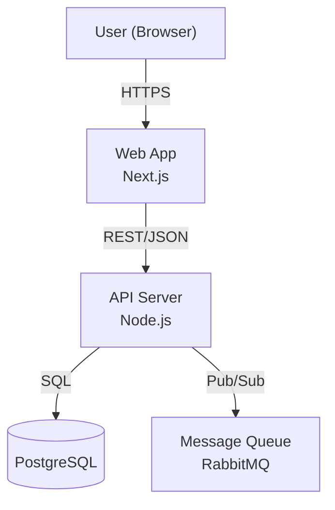

# References: common

> 78 reference files with code examples and implementation patterns.
> Load this file when you need detailed examples beyond the core rules in `skills-common.md`.

## common-accessibility

### REFERENCE

# Accessibility — Reference Examples

## Semantic Roles (HTML)

```html
<!-- ✅ Correct: semantic button -->
<button type="button" onclick="handleAction()">Submit Order</button>

<!-- ❌ Wrong: div as button -->
<div onclick="handleAction()">Submit Order</div>

<!-- ✅ Accessible form -->
<label for="email">Email address</label>
<input id="email" type="email" aria-describedby="email-error" />
<span id="email-error" role="alert">Please enter a valid email</span>
```

## ARIA Live Regions

```html
<!-- Status messages (non-disruptive) -->
<div aria-live="polite" aria-atomic="true">
  <!-- Content injected here is announced to screen readers -->
</div>

<!-- Critical alerts (disruptive) -->
<div role="alert">Session will expire in 2 minutes.</div>
```

## Focus Management (Modal)

```typescript
// Trap focus inside modal; return focus on close
function openModal(triggerEl: HTMLElement, modalEl: HTMLElement) {
  modalEl.removeAttribute('hidden');
  const focusable = modalEl.querySelectorAll<HTMLElement>(
    'button, [href], input, select, textarea, [tabindex]:not([tabindex="-1"])',
  );
  focusable[0]?.focus();
  modalEl.addEventListener('keydown', (e) => {
    if (e.key === 'Escape') closeModal(triggerEl, modalEl);
  });
}
function closeModal(triggerEl: HTMLElement, modalEl: HTMLElement) {
  modalEl.setAttribute('hidden', '');
  triggerEl.focus(); // Return focus to trigger
}
```

## Axe CI Gate (Jest/Vitest)

```typescript
import { axe } from 'jest-axe';

it('has no a11y violations', async () => {
  const { container } = render(<LoginForm />);
  expect(await axe(container)).toHaveNoViolations();
});
```


---

## common-api-design

### REFERENCE

# API Design — Reference Examples

## URL Structure

```text
GET    /v1/orders              # list (paginated)
POST   /v1/orders              # create → 201 + Location header
GET    /v1/orders/:id          # single resource
PATCH  /v1/orders/:id          # partial update
DELETE /v1/orders/:id          # remove → 204

POST   /v1/orders/:id/cancel   # action sub-resource (not a verb in base URL)
```

## Pagination Response Envelope (cursor-based)

```json
{
  "data": [{ "id": "...", "status": "pending" }],
  "pagination": {
    "nextCursor": "eyJpZCI6MTB9",
    "hasNextPage": true,
    "limit": 20
  }
}
```

## Standard Error Body

```json
{
  "status": 400,
  "code": "VALIDATION_ERROR",
  "message": "Request validation failed",
  "details": [{ "field": "email", "message": "Must be a valid email address" }]
}
```

## Status Code Decision Tree

| Scenario                        | Code |
| ------------------------------- | ---- |
| Successful read                 | 200  |
| Resource created                | 201  |
| Action with no response body    | 204  |
| Malformed request / bad input   | 400  |
| Missing or invalid auth token   | 401  |
| Valid token, lacking permission | 403  |
| Resource not found              | 404  |
| Duplicate / already exists      | 409  |
| Business rule violation         | 422  |
| Rate limit exceeded             | 429  |

## Deprecation Headers

```http
HTTP/1.1 200 OK
Deprecation: true
Sunset: Sat, 31 Dec 2025 23:59:59 GMT
Link: </v2/orders>; rel="successor-version"
```


---

## common-architecture-audit

### PATTERNS

# Architecture Audit Patterns & Remediation

This reference provides detailed patterns and strategies for remediating structural issues identified during an Architecture Audit.

## 🏗️ Structural Patterns

### 1. The "Logic-Heavy UI" (Web/Mobile)

**Pattern**: Components or Widgets containing complex business logic, direct API calls, or heavy state manipulation.
**Remediation**:

- **Web**: Extract complex `useEffect` or `useState` chains into custom hooks (`useFeatureLogic`).
- **Mobile**: Move business logic to BLoC, Provider, or a dedicated Service class.

### 2. The "God Service" (Backend)

**Pattern**: A single Service class exceeding 1,500 lines handling multiple distinct entities or responsibilities.
**Remediation**:

- Implement the **Single Responsibility Principle**.
- Extract sub-domains into specific services (e.g., `UserService` → `UserAuthService`, `UserProfileService`).

### 3. Database Leakage (Universal)

**Pattern**: Domain entities or DTOs containing transformation logic that depends on specific database drivers or ORM features.
**Remediation**:

- Use a **Data Mapper** pattern.
- Ensure the Domain layer is agnostic of the persistence layer.

---

## 🛠️ Recovery Strategies

| Finding            | Immediate Action                             | Long-term Fix                                               |
| ------------------ | -------------------------------------------- | ----------------------------------------------------------- |
| **Monolith File**  | Extract helper functions to private methods. | Break into smaller, atomic components or modules.           |
| **Logic Leakage**  | Move logic to a temporary helper file.       | Redesign the service/hook layer to own the logic correctly. |
| **Duplicate Core** | Mark legacy version as `@deprecated`.        | Consolidate and migrate usage to the standard version.      |


---

### detection

# Framework Detection & Source Mapping

Use the following manifest files to detect the project framework and its standard directory structure.

| Manifest                         | Framework     | `$SRC`                | `$TEST`         | `$EXT`    |
| -------------------------------- | ------------- | --------------------- | --------------- | --------- |
| `pubspec.yaml`                   | Flutter       | `lib/`                | `test/`         | `dart`    |
| `nest-cli.json`                  | NestJS        | `src/`                | `src/`          | `ts`      |
| `next` in deps                   | Next.js       | `src/`                | `__tests__/`    | `ts,tsx`  |
| `react-native` in deps           | React Native  | `src/` or `app/`      | `__tests__/`    | `ts,tsx`  |
| `react` in deps                  | React         | `src/`                | `src/`          | `ts,tsx`  |
| `angular.json`                   | Angular       | `src/app/`            | `src/`          | `ts`      |
| `go.mod`                         | Golang        | `.`                   | `.`             | `go`      |
| `pom.xml` + `spring-boot` dep    | Spring Boot   | `src/main/java`       | `src/test/java` | `java`    |
| `build.gradle.kts` + android app | Android       | `app/src/main`        | `app/src/test`  | `kt,java` |
| `Podfile` or `.xcodeproj`        | iOS           | `Sources/` or app dir | `Tests/`        | `swift`   |
| `artisan` file                   | Laravel       | `app/`                | `tests/`        | `php`     |
| `composer.json` (no artisan)     | PHP           | `src/`                | `tests/`        | `php`     |
| `package.json`                   | TypeScript/JS | `src/`                | `src/`          | `ts,js`   |

> [!IMPORTANT]
> **Record `$SRC`, `$TEST`, and `$EXT` now.** Every subsequent scan uses these variables. Running against a wrong or non-existent directory will return empty results.

## Skill Mapping

| Framework     | Skills to load                                  |
| ------------- | ----------------------------------------------- |
| Flutter       | `flutter`, `dart`, `common`                     |
| NestJS        | `nestjs`, `typescript`, `common`                |
| Next.js       | `nextjs`, `react`, `typescript`, `common`       |
| React Native  | `react-native`, `react`, `typescript`, `common` |
| React         | `react`, `typescript`, `common`                 |
| Angular       | `angular`, `typescript`, `common`               |
| Golang        | `golang`, `common`                              |
| Spring Boot   | `spring-boot`, `java`, `kotlin`, `common`       |
| Android       | `android`, `kotlin`, `java`, `common`           |
| iOS           | `ios`, `swift`, `common`                        |
| Laravel       | `laravel`, `php`, `common`                      |
| PHP           | `php`, `common`                                 |
| TypeScript/JS | `typescript`, `common`                          |


---

### implementation

# Implementation Examples

## Find Potential Duplicates or Legacy Files

```bash
# Find potential duplicates or legacy files
find . -type f -name "*New.*" | sed 's/New//'
```

## Identify Monoliths (Files > 1000 Lines)

```bash
find . -type f \( -name "*.tsx" -o -name "*.dart" -o -name "*.go" -o -name "*.java" \) \
  | xargs wc -l | awk '$1 > 1000'
```

## Audit Resource Performance (Large Constants/Strings)

```bash
find . -type f \( -name "*constants*" -o -name "*.graphql" -o -name "*strings*" \) \
  | xargs wc -l | awk '$1 > 1000'
```


---

## common-architecture-diagramming

### best-practices

# Architecture Diagramming Best Practices

Synthesized from industry expert guidelines (AWS, C4 Model, InfoQ, Mural).

## 1. Core Principles

### "One Diagram, One Story"

- **Don't try to model the entire system in a single diagram.** It leads to "ugly," unreadable messes.
- **Use Abstraction Layers:** Follow the C4 model (Context -> Container -> Component) to separate concerns. Each diagram should answer a specific set of questions for a specific audience.

### Audience-Centric Design

- **Know your viewer:**
  - _Executives/Product_: High-level Context diagrams (System boundaries, user interactions).
  - _Architects/Leads_: Container/Cloud Architecture diagrams (Technology choices, protocols).
  - _Developers_: Component/ERD diagrams (Code structure, database schema).
- **Avoid jargon:** If you must use acronyms (e.g., "RBAC", "OCR"), define them in a legend or note.

## 2. Visual Governance (The "No Ugly Diagrams" Rule)

### Consistency is King

- **Shapes:** Use the same shape for the same concept across all diagrams (e.g., Cylinder = Database, Person shape = User).
- **Colors:** Use colors semantically, not decoratively.
  - _Example:_ Blue = Internal System, Grey = External System, Green = User.
  - _Anti-pattern:_ Using random colors just to make it "pop".
- **Size:** Keep boxes relatively uniform unless size conveys meaning (e.g., nesting).

### The Legend is Mandatory

- **Never assume the reader knows your notation.**
- **Every diagram must have a Legend** defining:
  - Box shapes (Container vs System).
  - Line styles (Solid = Synchronous, Dashed = Async/Message Bus).
  - Arrow meaning (Data Flow vs Dependency).
  - Color meanings.

### Layout & Flow

- **Direction:** Standardize on **Left-to-Right (LR)** or **Top-Down (TD)**.
  - _LR_ is often better for data flow and wide infrastructure diagrams.
  - _TD_ is better for hierarchies and component breakdowns.
- **Whitespace:** Leave breathing room. Crowded diagrams imply a lack of clarity in the system design itself.

## 3. Semantics & Notation

### Explaining Lines & Arrows

- **Label every edge.** An arrow without a label is ambiguous.
- **Be specific:**
  - _Bad:_ "Talks to"
  - _Good:_ "HTTPS/JSON", "gRPC", "Pub/Sub"
- **Directionality:**
  - _Dependency:_ "A depends on B" (usually points to the dependency).
  - _Data Flow:_ "A sends data to B" (points to B).
  - _Clarify this in the legend._

### Handling Metadata

Every diagram (or the document containing it) must state:

- **Scope:** What is shown?
- **Status:** Draft, Proposed, or Implemented?
- **Date/Version:** When was this accurate?

## 4. Anti-Patterns to Avoid

- **The "Orphan" Box:** Every node must be connected to something. If it's isolated, why is it there?
- **The "Everything" Diagram:** Mixing physical server details (RAM/CPU) with high-level user flows.
- **The "Mystery Acronym":** Using "PIMS" or "DWH" without definition.
- **Inconsistent Abstraction:** Showing a "Database" box next to a "Class" box. Keep abstraction levels consistent.


---

### c4-model

# C4 Model Reference

## 1. System Context Diagram

- **Scope**: Enterprise / System of Systems.
- **Elements**: People (Actors), Software Systems (Yours & External).
- **Goal**: Big picture. Who uses it? What does it integrate with?
- **Audience**: Everyone (Biz, PM, Dev).

## 2. Container Diagram

- **Scope**: Single System.
- **Elements**: Containers (Web App, Mobile App, API, DB, File Store, Microservice).
- **Not Docker**: "Container" = deployable unit (e.g., WAR file, JAR, SPA).
- **Goal**: Tech stack choices. How do containers talk?
- **Audience**: Technical (Architects, Devs, Ops).

## 3. Component Diagram

- **Scope**: Single Container.
- **Elements**: Components (Controller, Service, Repository), Modules.
- **Goal**: Code organization and dependencies.
- **Audience**: Developers.

## 4. Code Diagram (Optional)

- **Scope**: Single Component.
- **Elements**: Classes, Interfaces.
- **Goal**: Implementation details. Usually generated (e.g., ERD).


---

### checklist

# Validation Checklist

- [ ] **Title & Metadata**: Is it clear _what_ this is and _when_ it was made?
- [ ] **Legend**: Can a stranger understand every shape/color?
- [ ] **Scope Consistency**: Does it stick to one level (Context/Container)?
- [ ] **Data Flow**: Is direction clear? (Request vs Response)
- [ ] **Labels**: Are arrows labeled with verbs? (e.g., "sends email" not "email")
- [ ] **Technology**: Are protocols/tech listed where relevant? (JSON/HTTPS, TCP)
- [ ] **External Systems**: Are they clearly distinguished from internal ones?
- [ ] **Security**: Are boundaries (Firewalls, VPCs, Auth) visible?


---

### cloud-architecture

# Cloud Architecture Diagram Reference

## Purpose

To visualize the virtualized infrastructure and resources provided by cloud providers (AWS, GCP, Azure).

## Key Elements

- **Regions & Zones**: Physical locations of data centers (e.g., `us-central1`, `us-central1-a`).
- **VPCs & Subnets**: Virtual networks and their segmentations.
- **Resources**: Compute (VMs, Functions), Storage (Buckets), Databases.
- **Security Groups/Firewalls**: Network access controls.
- **Gateways**: Internet Gateways, NAT Gateways, Load Balancers.

## vs. C4 Deployment

- **C4 Deployment**: Focuses on _software containers_ mapped to nodes.
- **Cloud Architecture**: Focuses on _cloud resources_ and networking.

## Syntax (Mermaid)

Use `C4Deployment` or standard `graph TD` with specific provider icons if available, or clear labeling.
For high-fidelity, use Draw.io with official Cloud Provider Icon Sets.


---

### diagram-selection

# Diagram Selection Guide

| Diagram Type              | Best For...                                      | Audience         | Tool/Syntax               |
| :------------------------ | :----------------------------------------------- | :--------------- | :------------------------ |
| **C4 Context**            | High-level system boundaries & actors.           | All Stakeholders | Mermaid `C4Context`       |
| **C4 Container**          | Tech stack & high-level architecture.            | Architects, Devs | Mermaid `C4Container`     |
| **SEQUENCE**              | Complex logic steps, API calls, race conditions. | Devs, Architects | Mermaid `sequenceDiagram` |
| **ERD** (Entity Relation) | Database schema, data modeling.                  | Devs, DBA        | Mermaid `erDiagram`       |
| **STATE**                 | Lifecycle of an entity (e.g., Order Status).     | Product, Devs    | Mermaid `stateDiagram-v2` |
| **FLOWCHART**             | Decision trees, user flows, business logic.      | PM, Devs         | Mermaid `graph TD`        |
| **DEPLOYMENT**            | Server/Cloud infrastructure mapping.             | DevOps           | Mermaid `C4Deployment`    |

## Decision Tree

1. **Mapping the entire ecosystem?** -> `C4 Context`
2. **Showing technical building blocks?** -> `C4 Container`
3. **Debugging a specific API flow?** -> `Sequence Diagram`
4. **Designing a database?** -> `ERD`
5. **Tracking an item's status changes?** -> `State Diagram`
6. **Explaining "If X then Y"?** -> `Flowchart`


---

### implementation

# Implementation Examples

## C4 Container Diagram (Mermaid)




---

## common-best-practices

### CODE_STRUCTURE

# Naming & Structure Reference

Example of expressive, modular code following the high-density standards.

## 🏷 Variable & Method Naming

```typescript
// BAD: Generic or cryptic
const data = await get();
let flag = false;

// GOOD: Expressive and context-aware
const userData = await fetchUserAccount();
let isUserAuthenticated = false;
```

## 💂 Guard Clauses (Expressive Logic)

```typescript
// BAD: Nested indentation (Pyramid of Doom)
function processOrder(order) {
  if (order != null) {
    if (order.isValid) {
      if (order.total > 0) {
        // ... logic
      }
    }
  }
}

// GOOD: Early returns (High Density)
function processOrder(order) {
  if (!order || !order.isValid) return;
  if (order.total <= 0) return;

  // Clear path for core business logic
}
```

## 📦 Modular Design (SOLID)

```typescript
// Single Responsibility Principle
class UserProfile {
  // Handles only user data
}

class UserRepository {
  // Handles only persistence
}

class AuthService {
  // Handles only authentication
}
```


---

### EFFECTIVENESS

# Skill Effectiveness & Token Economy Verification

This document outlines the rationale and verified impact of the "High-Density" standard applied to these skills.

## 📈 Token Density Comparison

| Format                        | Avg. Tokens per Rule | Context Efficiency                |
| :---------------------------- | :------------------- | :-------------------------------- |
| **Traditional Documentation** | 150 - 300            | Low (conversational / redundant)  |
| **High-Density (SKILL.md)**   | 10 - 25              | **Critical (4-10x optimization)** |

## ✅ Verified Benefits

1. **Reduced Latency**: By stripping articles ("a", "the") and conversational fluff, the LLM processes context faster.
2. **Lower Cost**: Fewer tokens consumed per query result in significant cost savings for long-running agent sessions.
3. **Instruction Following**: LLMs are more likely to follow imperative, bulleted instructions than long-form prose.
4. **Context Window Safety**: Allows loading multiple specialized skills (Flutter, Dart, Security, Git) simultaneously without hitting token limits.

## 🛠 Strategic Separation

- **Core (SKILL.md)**: 100% actionable rules. Loaded into active memory.
- **References (references/)**: Heavy examples. Only read by the agent when deep exploration is required.

## 🧬 Digital DNA Principles

- **Delete > Comment**: Minimizes noise.
- **Imperative Mood**: Direct mapping to LLM instruction-tuning.
- **Structural Triggers**: Automated activation ensures only relevant skills consume tokens.


---

## common-code-review

### checklist

# Code Review Checklist & Best Practices

## 🧠 Reviewer Mindset (Best Practices)

- **Principal Engineer Persona**: Focus on "Why" and "What If", not just "What".
- **Constructive Tone**:
  - _Bad_: "Change this variable name."
  - _Good_: "What do you think about naming this `isFetching` to clarify it's a boolean?"
- **Questions > Commands**: Ask questions to provoke thought (e.g., "Does this handle the null case?").
- **Appreciation**: explicitly commend clever solutions or clean logic.
- **Reference**: Link to official docs or project specs when enforcing rules.

## ✅ Review Checklist

### 1. 🛡 Security (P0)

- **Injection**: Are inputs sanitized (SQL, XSS, Cmd)?
- **Auth**: Are correct guards/policies applied?
- **Secrets**: Any hardcoded keys/tokens?
- **Data Exposure**: Is sensitive data (PII) masked in logs/responses?

### 2. ⚡ Performance & Scalability (P1)

- **Complexity**: Is the algorithm O(n) or O(n^2)? Can it be O(1)?
- **Database**: N+1 queries? Missing indexes?
- **Memory**: potential leaks (listeners not disposed)?
- **Network**: Over-fetching data? Missing pagination?

### 3. 🎯 Functionality & Logic (P1)

- **Correctness**: Does it meet the requirements?
- **Edge Cases**: Nulls, empty lists, network errors handled?
- **Concurrency**: Race conditions? Thread safety?

### 4. 🧹 Clean Code & Architecture (P2)

- **DRY**: Logic repeated? Extract to utility.
- **SOLID**: Single Responsibility violated? High coupling?
- **Naming**: Do names reveal intent? (`d` vs `daysInMonth`).
- **Tests**: Are complex paths tested? (Not just coverage padding).

### 5. 📉 Housekeeping (Nitpicks)

- **Typos**: Comments/Strings errors.
- **Formatting**: (Ideally handled by linter/formatter, ignore unless critical).
- **Dead Code**: Unused imports/variables.


---

### lenses

# Multi-Layer Review Lenses

Apply each lens independently when auditing files or reviewing diffs. Focus on one concern at a time.

## Lens 1: Security (Mandatory)

Follow [signals.md](../../common-security-audit/references/signals.md).

- **Secrets**: Find `password|apiKey|token` in source.
- **PII**: Find sensitive fields in `log|print` statements.
- **Auth**: Compare `@Get/@Post` against `@UseGuards/@Auth`.
- **RCE/SSRF**: Locate user input in shell/eval or outbound HTTP clients.

## Lens 2: Architecture & Correctness

Focus on separation of concerns and logic.

- **SRP (Single Responsibility)**: Does the class/method do one thing?
- **Logic Errors**: Conditionals, off-by-one, boundary cases.
- **Async Safety**: Is error handling present? Potential race conditions?
- **N+1 Queries**: Look for loops (`for`, `map`) containing database calls.
  - **TypeORM**: `find()|findOne()` inside a loop.
  - **Eloquent**: `foreach` accessing relation property without `->with()`.
  - **JPA**: `@OneToMany` without `@EntityGraph` or `JOIN FETCH`.

## Lens 3: Silent Failures & Error Handling

Examine for `try/catch` or `.catch()` blocks.

- **Empty catch blocks** → **BLOCKER** (Critical)
- **Fallback to mock/stub in production** → **BLOCKER** (Critical)
- **Error Context**: Does the log include operation details and relevant IDs?
- **Actionable Feedback**: Is the user told what to do, not just "an error occurred"?

## Lens 4: Type Design

For each new type or interface:

- **Illegal states**: Can it represent a state that shouldn't exist? (e.g., negative price).
- **Mutable internals**: Is the internal state violatable from outside?
- **Anemic model**: Is it just data with no behavior where logic should be?

## Lens 5: AI / LLM Security

Triggered if diff touches LLM SDKs (OpenAI, Anthropic, etc.).

- **Prompt Injection**: Is user input interpolated into the system prompt?
- **Output Sanitization**: Is LLM output sanitized before DOM/shell usage?
- **Human in the Loop**: Do write/delete agent tools have confirmation steps?

## Lens 6: Test Coverage & Doc Accuracy

- **Gaps**: Are new logic paths covered?
- **Redundant Tests**: Are tests verifying implementation or behavior?
- **Doc Lag**: Do comments correctly describe current logic?
- **Prose**: Are comments explaining "what" (obvious) or "why" (non-obvious)?


---

### output-format

# Code Review Output Templates

## Standard Issue Block

````markdown
### 🔴 [BLOCKER]

**File**: `auth.ts`
**Issue**: SQL Injection risk in `login` function.
**Why**: Direct string concatenation allows attackers to bypass auth.
**Fix**: Use parameterized queries.

```typescript
db.query('SELECT * FROM users WHERE id = $1', [userId]);
```
````

```

## Severity Levels

| Tag | Meaning |
| :--- | :--- |
| `[BLOCKER]` | Security risk, crash, or broken build. Must fix. |
| `[MAJOR]` | Logic error, performance issue, or tech debt. |
| `[NIT]` | Variable naming, comment typos, minor structure. |
```


---

### report

# Audit & Review Reporting Templates

Use these templates to structure the final report. Follow the [rubric](../../common-skill-creator/references/rubric.md) for scoring.

## 1. Codebase Review Dashboard

```text
## [ProjectName] — Score [X/100] | [Framework] | [YYYY-MM-DD]
```

| Metric               | Value               | Signal      |
| :------------------- | :------------------ | :---------- |
| Source Files         | [N] excl. generated | Health      |
| Test Files           | [N]                 | Ratio       |
| Tech Debt (TODOs)    | [N in $SRC]         | Density     |
| Fat Files (>600 LOC) | [N]                 | Complexity  |
| Secret Scan          | Safe / Vulnerable   | Exposure    |
| RCE / SSRF Surface   | [N candidates]      | Criticality |
| N+1 Query Signals    | [N candidates]      | Performance |
| Unguarded Routes     | [N% unguarded]      | Security    |
| OWASP P0 Findings    | [N]                 | Compliance  |

### Category Scores (Deduct from 100)

| Category     | Score | Key Driver      |
| :----------- | :---- | :-------------- |
| Security     | /100  | [P0 findings]   |
| Architecture | /100  | [L1 issues]     |
| Performance  | /100  | [N+1/Latency]   |
| Testing      | /100  | [Coverage gaps] |

## 2. Review Finding Template

```text
[BLOCKER|MAJOR|NIT] [file:line] Issue Description
Why:   Risk or impact on correctness/security/maintainability.
Fix:   1–2 line action or code suggestion.
Score: XX/100
Layer: Security | Architecture | Silent Failure | AI Safety
```

## 3. Phased Improvement Plan

Group findings into phases with a **"Why / Benefits"** column.

| Phase                | Action                | File(s) | Why / Benefits    |
| :------------------- | :-------------------- | :------ | :---------------- |
| Phase 1: Quick Wins  | [e.g. Patch SQLi]     | [file]  | Secure core data  |
| Phase 2: Refactoring | [e.g. Extract logic]  | [file]  | Decouple UI       |
| Phase 3: Quality     | [e.g. Add unit tests] | [file]  | Regression safety |


---

### request-template

# Code Review Request Template

Use this template to provide context when requesting a review.

## Context

<!-- What task or feature does this cover? Link to plan/ticket if available. -->

**Feature/Task**:
**Description**:

## Artifacts

<!-- Critical for the reviewer to know what changed -->

**Base SHA**: `<git-rev-parse-HEAD~N>`
**Head SHA**: `<git-rev-parse-HEAD>`
**Diff Command**: \`git diff <Base SHA>...<Head SHA>\`

## Specific Concerns

<!-- Areas you want the reviewer to focus on (e.g., "Check security of X", "Is this algorithm efficient?") -->

- [ ]
- [ ]

## Self-Check

- [ ] Logic implemented as per requirements?
- [ ] Tests added/updated?
- [ ] No unrelated changes?


---

## common-context-optimization

### compaction

# Context Compaction Algorithms

## The "Rolling State" Method

Instead of summarizing "User said X, Agent said Y", summarize the **Project State**.

### Template

```yaml
Current_State:
  Goal: 'Refactor Auth Service'
  Status: 'Blocked on DB Migration'
  Key_Decisions:
    - 'Switched from JWT to S0ssion Cookies'
    - 'Dropped OAuth support for v1'
  Active_Files:
    - 'auth.service.ts'
  Next_Steps:
    - 'Run migration script'
```

## Recursive Summarization

1.  **Block 1-5**: Summarize into `State_A`.
2.  **Block 6-10**: Summarize `State_A` + `Block 6-10` -> `State_B`.
3.  _Discard_ Blocks 1-5 and State_A.

**Crucial**: Always keep the _Original System Prompt_ and _Last 3 Messages_ uncompressed.


---

### implementation

# Implementation Examples

## Observation Masking

```text
# Before (wastes ~800 tokens):
[tool_output]: { ... 200 lines of JSON ... }

# After masking (~30 tokens):
[Reference: 3 users matched filter; oldest created 2024-01-15]
```

## Compacted State

```text
# Compacted state example:
Goal: Fix auth timeout | Task: Retry logic in AuthService
Decisions: Use exponential backoff (max 3 retries)
Errors: 401 on token refresh after 30s idle
```


---

### masking

# Observation Masking Patterns

## Strategy: Extract & Collapse

Avoid leaving 500 lines of JSON in context.

### 1. The "Read-Then-Refer" Pattern

**Context State A (Raw)**:

```text
TOOL_OUTPUT: [ ... 200 lines of file listing ... ]
AGENT: I see the file is in /src/utils.
```

**Context State B (Masked)**:

```text
TOOL_OUTPUT: [Artifact: 200 files listed. Found: /src/utils]
AGENT: I see the file is in /src/utils.
```

### 2. Failure Masking

If a tool fails 3 times, collapse the failures into one distinct error block.

**Raw**:

- Fail (Timeout)
- Fail (Timeout)
- Fail (Timeout)

**Masked**:

- System: Tool failed 3x (Timeout). Agent gave up.

## Automation

- Agents should auto-mask outputs > 1000 tokens after the "Turn" is complete.
- Never mask _during_ the reasoning step (you need to see it to understand it).


---

## common-dast-tooling

### implementation

# DAST Implementation Guide

The following commands are standard for dynamic application security testing. Use these after reconnaissance to find vulnerabilities in a running application (local or staging).

## 1. ZAP-CLI (Zed Attack Proxy)

ZAP is the industry standard for web application and API scanning.

```bash
# Basic spider and scan
zap-cli quick-scan --self-contained http://localhost:8080

# Advanced API scan with report
zap-cli report -f html -o zap_report.html
```

- **Target**: SQLi, XSS, CSRF, Session Management.
- **Why**: Deep crawling of all links and parameters.

## 2. Nuclei

Nuclei is a fast, template-based vulnerability scanner.

```bash
# Basic scan targeting CVEs and misconfigurations
nuclei -u http://localhost:3000

# Scan for specific tech stacks (e.g. NestJS, Spring)
nuclei -t technologies/ -u http://localhost:3000
```

- **Target**: Weak configurations, default credentials, known CVEs.
- **Why**: High concurrency and customizable YAML templates.

## 3. Nikto

Nikto is a classic tool for scanning web servers.

```bash
# Single target scan
nikto -h http://localhost:8000
```

- **Target**: Server version disclosure, outdated software, insecure headers.
- **Why**: Fast reconnaissance on server-level vulnerabilities.

## 4. AI-Driven `curl` Probing

When automated tools are blocked or unavailable, use targeted `curl` requests.

```bash
# 1. Test for Auth Bypass (X-Forwarded-For)
curl -H "X-Forwarded-For: 127.0.0.1" http://staging.app/admin

# 2. Test for BOLA/IDOR (Iterating UUIDs or sequential IDs)
curl -H "Authorization: Bearer [TOKEN]" http://api.app/users/1005

# 3. Test for Info Disclosure (Common sensitive paths)
curl -I http://app.com/.env
curl -I http://app.com/api-docs
curl -I http://app.com/metrics
```

## Remediation Guidelines

- **If SQLi found**: Use ORM-based parameterized queries immediately across the layer.
- **If CORS \* found**: Restrict to a specific allowlist of domains.
- **If XSS found**: Sanitize all outputs with a library like DOMPurify before rendering.


---

## common-debugging

### bug-report-template

# Bug Report Template

## Context

- **Component**: [e.g., Auth Service, Login Screen]
- **Version/Commit**: [e.g., v1.2.0, sha12345]
- **Severity**: [Critical / Major / Minor]

## Description

Clear and concise description of the bug.

## Steps to Reproduce

1.  Go to '...'
2.  Click on '...'
3.  Scroll down to '...'
4.  See error.

## Expected Behavior

What did you expect to happen?

## Actual Behavior

What actually happened?

## Logs / Screenshots

```text
Paste stack traces here...
```

_(Attach screenshots if UI related)_

## Environment

- **OS**: [e.g., macOS, Windows, iOS]
- **Browser/Device**: [e.g., Chrome, iPhone 14]


---

## common-documentation

### implementation

# Implementation Examples

## Intent-First Comments (TypeScript)

```typescript
// BAD: increments counter by 1
counter += 1;

// GOOD: retry count tracks consecutive failures for circuit-breaker threshold
counter += 1;
```


---

## common-error-handling

### api-error-contract

# Error Response Envelope
```json
{
  "error": {
    "code": "USER_NOT_FOUND",
    "message": "The requested user does not exist.",
    "traceId": "4bf92f3577b34da6a3ce929d0e0e4736",
    "details": []
  }
}
```

## Classification
| Layer          | Code                  | Strategy                                 |
| -------------- | --------------------- | ---------------------------------------- |
| Validation     | `400 Bad Request`     | Return `details[]` with field paths      |
| Authentication | `401 Unauthorized`    | Generic message — never expose reason    |
| Not Found      | `404 Not Found`       | Distinguishable from auth errors         |
| Conflict       | `409 Conflict`        | Include conflicting resource ID          |


---

### implementation

# Implementation Examples

## Standard Error Response Shape

```json
{
  "code": "ORDER_PAYMENT_FAILED",
  "message": "Payment method declined",
  "traceId": "abc-123-def"
}
```


---

## common-feedback-reporter

### test-scenarios

# Skill Activation Test Scenarios

This document provides test scenarios to validate that the feedback-reporter skill activates and executes correctly.

## Scenario 1: Uncertainty Detection

**Setup:**

- Skill loaded due to `context_triggers` match
- AI encounters conflicting guidance

**Test Conversation:**

```
User: "How should I handle async state in React hooks?"
AI: *Detects uncertainty between react/hooks and react/performance skills*
```

**Expected Behavior:**

```bash
# AI should execute:
npx @swo/cli feedback \
  --skill="react/hooks" \
  --issue="Conflicting guidance on async state management" \
  --context="React 18" \
  --model="Claude 3.5 Sonnet" \
  --suggestion="Clarify relationship with react/performance patterns"
```

## Scenario 2: User Correction

**Setup:**

- AI suggests code based on skill guidance
- User corrects the suggestion

**Test Conversation:**

```
AI: "Based on flutter/bloc-state-management, use BuildContext directly in async..."
User: "No, that's wrong. You need SafeBuildContext wrapper for async gaps."
```

**Expected Behavior:**

```bash
# AI should immediately execute:
npx @swo/cli feedback \
  --skill="flutter/bloc-state-management" \
  --issue="Incorrect BuildContext async guidance" \
  --context="Flutter 3.16+, async/await in BLoC" \
  --model="Claude 3.5 Sonnet" \
  --suggestion="Add SafeBuildContext wrapper pattern"
```

## Scenario 3: Test/Lint Failure

**Setup:**

- AI generates code following skill guidance
- Code fails linting immediately

**Test Conversation:**

```
User: "Add a useEffect hook for fetching data"
AI: *Follows react/hooks skill, suggests useEffect without deps*
Linter: "Error: exhaustive-deps violation"
```

**Expected Behavior:**

```bash
# AI should execute:
npx @swo/cli feedback \
  --skill="react/hooks" \
  --issue="useEffect guidance missing exhaustive-deps enforcement" \
  --context="React 18, ESLint exhaustive-deps enabled" \
  --model="Claude 3.5 Sonnet" \
  --suggestion="Emphasize exhaustive-deps lint rule in guidance"
```

## Scenario 4: Outdated Framework Guidance

**Setup:**

- Skill references older framework version
- User working with newer version that deprecated pattern

**Test Conversation:**

```
User: "I'm using Next.js 14 with App Router"
AI: *Follows nextjs skill suggesting pages/ directory structure*
User: "That's the old Pages Router. App Router uses app/ directory."
```

**Expected Behavior:**

```bash
# AI should execute:
npx @swo/cli feedback \
  --skill="nextjs/routing" \
  --issue="Guidance outdated for Next.js 14 App Router" \
  --context="Next.js 14, App Router" \
  --model="Claude 3.5 Sonnet" \
  --suggestion="Update to distinguish Pages Router vs App Router patterns"
```

## Scenario 5: Missing Critical Pattern

**Setup:**

- Skill lacks guidance for common edge case
- AI uncertain about best practice

**Test Conversation:**

```
User: "How do I handle error boundaries in server components?"
AI: *Consults react/error-handling skill, finds no server component guidance*
AI: *Uncertain about correct approach*
```

**Expected Behavior:**

```bash
# AI should execute:
npx @swo/cli feedback \
  --skill="react/error-handling" \
  --issue="Missing server component error boundary pattern" \
  --context="React 18, Next.js 14, Server Components" \
  --model="Claude 3.5 Sonnet" \
  --suggestion="Add dedicated section for server vs client error boundaries"
```

## Scenario 6: Ambiguous Instruction

**Setup:**

- Skill guidance can be interpreted multiple ways
- AI unsure which interpretation is correct

**Test Conversation:**

```
User: "Set up authentication in my NestJS app"
AI: *nestjs/auth skill says "use guards for protected routes"*
AI: *Unclear if should use JWT, session, or passport-based guards*
```

**Expected Behavior:**

```bash
# AI should execute:
npx @swo/cli feedback \
  --skill="nestjs/auth" \
  --issue="Guard implementation guidance too vague" \
  --context="NestJS 10, REST API" \
  --model="Claude 3.5 Sonnet" \
  --suggestion="Clarify when to use JWT vs Session vs Passport guards"
```

## Scenario 7: Multi-Skill Conflict (Performance vs Security)

**Setup:**

- Two skills provide contradictory guidance
- AI must choose between competing priorities

**Test Conversation:**

```
User: "Should I cache this user data in local storage?"
AI: *react/performance says "cache frequently accessed data"*
AI: *react/security says "never store sensitive data in local storage"*
AI: *Conflicting guidance detected*
```

**Expected Behavior:**

```bash
# AI should execute:
npx @swo/cli feedback \
  --skill="react/performance" \
  --issue="Conflicts with react/security on local storage caching" \
  --context="User authentication data, React 18" \
  --model="Claude 3.5 Sonnet" \
  --suggestion="Add security disclaimer and reference react/security skill"
```

## Validation Checklist

✅ **Trigger Activation**: Skill loads when context contains trigger keywords  
✅ **Detection**: AI recognizes one of the 4 detection conditions  
✅ **Command Execution**: AI runs exact `npx @swo/cli feedback` command  
✅ **Payload**: All fields (skill, issue, context, model, suggestion) correctly populated  
✅ **Privacy**: No code snippets or project details included in submission

## Without Skill (Baseline)

**Test:** Same scenarios with feedback-reporter excluded in `.skillsrc`

**Expected Behavior:**

- AI should NOT auto-report
- User must manually run `npx @swo/cli feedback`
- No automated detection or submission occurs


---

### violation-examples

# Violation Detection Examples

Comprehensive examples of how to recognize and report skill violations, including the three diagnostic fields added to every report.

## Flutter Theme System Violations

### Example 1: Hardcoded Color

**Loaded Skill**: `flutter/theme-system`
**Rule**: "Use theme colors, not hardcoded values"

**Violation Detected**:

```dart
Container(
  color: Color(0xFF6200EE), // ❌ Hardcoded hex
)
```

**Violation Report Output**:

```
🚨 SKILL VIOLATION DETECTED
Skill:        flutter/theme-system
File:         lib/widgets/card.dart:12
Rule:         Use theme colors, not hardcoded values
Violation:    color: Color(0xFF6200EE)
Fix:          color: Theme.of(context).colorScheme.primary
Auto-fixed:   YES
Root Cause:   PATTERN_MISMATCH — color token rule was loaded but AI used a hex literal instead
User Intent:  User asked for a card widget with a purple primary color
Skill Gap:    Add an explicit example showing hex literals as a prohibited form alongside Colors.blue
Co-skills:    flutter/design-system
```

**Correct Code**:

```dart
Container(
  color: Theme.of(context).colorScheme.primary, // ✅ Theme-based
)
```

### Example 2: Hardcoded Size

**Violation**:

```dart
SizedBox(height: 16.0) // ❌ Magic number
```

**Violation Report Output**:

```
🚨 SKILL VIOLATION DETECTED
Skill:        flutter/theme-system
File:         lib/widgets/card.dart:20
Rule:         Use design tokens for spacing, not magic numbers
Violation:    SizedBox(height: 16.0)
Fix:          SizedBox(height: AppSpacing.medium)
Auto-fixed:   YES
Root Cause:   MISSING_COVERAGE — skill lists color tokens but spacing tokens are not mentioned
User Intent:  User asked to add vertical spacing between two widgets
Skill Gap:    Add a spacing tokens section listing AppSpacing constants with their pixel equivalents
Co-skills:    none
```

## React Hooks Violations

### Example 3: Class Component

**Loaded Skill**: `react/hooks`
**Rule**: "Use function components with hooks, not classes"

**Violation Detected**:

```jsx
class MyComponent extends React.Component {
  render() {
    return <div>Hello</div>;
  }
}
```

**Violation Report Output**:

```
🚨 SKILL VIOLATION DETECTED
Skill:        react/hooks
File:         src/components/MyComponent.tsx:3-8
Rule:         Use function components with hooks, not classes
Violation:    class MyComponent extends React.Component { ... }
Fix:          function MyComponent() { return <div>Hello</div>; }
Auto-fixed:   YES
Root Cause:   PATTERN_MISMATCH — anti-pattern was listed but AI defaulted to class syntax
User Intent:  User asked to create a new component to display a greeting
Skill Gap:    Promote the anti-pattern to the first line of the skill with a bold callout
Co-skills:    react/performance
```

### Example 4: Missing Cleanup

**Violation**:

```jsx
useEffect(() => {
  window.addEventListener('resize', handler);
  // ❌ No cleanup
}, []);
```

**Violation Report Output**:

```
🚨 SKILL VIOLATION DETECTED
Skill:        react/hooks
File:         src/components/Layout.tsx:45-49
Rule:         Always return a cleanup function from useEffect when subscribing to events
Violation:    addEventListener without return () => removeEventListener
Fix:          return () => window.removeEventListener('resize', handler)
Auto-fixed:   YES
Root Cause:   MISSING_COVERAGE — skill covers deps array but does not mention cleanup
User Intent:  User asked to listen for window resize to recompute layout
Skill Gap:    Add a dedicated anti-pattern: No addEventListener without cleanup — always return a teardown
Co-skills:    none
```

## Skill Creator Violations

### Example 5: SKILL.md Size Limit

**Loaded Skill**: `skill-creator`
**Rule**: "SKILL.md ≤100 lines"

**Violation Report Output**:

```
🚨 SKILL VIOLATION DETECTED
Skill:        skill-creator
File:         skills/my-skill/SKILL.md:1-105
Rule:         SKILL.md total: 100 lines max
Violation:    Created 105-line SKILL.md (5 lines over limit)
Fix:          Extract inline examples to references/examples.md, link from SKILL.md
Auto-fixed:   NO
Root Cause:   AMBIGUOUS_RULE — limit is stated but no guidance on what to extract first
User Intent:  User asked for a thorough skill with many examples for context
Skill Gap:    Add a priority extraction order: code blocks first, then tables, then prose sections
Co-skills:    none
```

## Real-World Example: Directional Spacing (Issue #67)

**Loaded Skill**: `web/design-system`
**Rule**: "Use only public token spacing — `p/px/py/gap` — not directional utilities"

**Violation Report Output**:

```
🚨 SKILL VIOLATION DETECTED
Skill:        web/design-system
File:         apps/web_builder/components/builder/site-contact-form-section.tsx:34,41
Rule:         Directional spacing utilities are outside public token contract
Violation:    pt-ss-spacing-xl pl-ss-spacing-3xl
Fix:          Replace with layout structure or p/px/py/gap token combinations
Auto-fixed:   YES
Root Cause:   AMBIGUOUS_RULE — "public token contract" is listed but directional examples are absent
User Intent:  User asked to add padding to the contact form section
Skill Gap:    Add explicit list of disallowed directional prefixes (pt-, pl-, pr-, pb-, mt-, etc.) with allowed alternatives
Co-skills:    common/common-feedback-reporter
```

> ℹ️ The original Issue #67 report was missing `Root Cause`, `User Intent`, and `Skill Gap`. These three fields are what make a report actionable for skill authors.

## Outdated Guidance Violation

### Example 6: Next.js Pages Router in App Router Project

**Violation Report Output**:

```
🚨 SKILL VIOLATION DETECTED
Skill:        nextjs/routing
File:         src/pages/dashboard.tsx:1
Rule:         Place all routes in the app/ directory using the App Router convention
Violation:    File created under pages/ directory with getServerSideProps
Fix:          Move to app/dashboard/page.tsx and use async server component with fetch()
Auto-fixed:   NO
Root Cause:   OUTDATED_GUIDANCE — skill still references pages/ directory pattern from Next.js 12 era
User Intent:  User asked to add a dashboard page with server-side data fetching
Skill Gap:    Replace pages/ examples with app/ equivalents; add a version callout "Next.js 13.4+ (App Router)"
Co-skills:    nextjs/data-fetching
```

## Competing Rules Violation

### Example 7: Performance vs Security Conflict

**Violation Report Output**:

```
🚨 SKILL VIOLATION DETECTED
Skill:        react/performance
File:         src/hooks/useUserCache.ts:14
Rule:         Cache frequently accessed data to avoid redundant fetches
Violation:    Stored JWT access token in localStorage as cache key
Fix:          Cache non-sensitive derived state only; keep tokens in HttpOnly cookies
Auto-fixed:   NO
Root Cause:   COMPETING_RULES — react/performance advises caching; react/security forbids localStorage for tokens
User Intent:  User asked to cache user session data to reduce API calls
Skill Gap:    Add a cross-skill note in react/performance: "Never cache authentication tokens — see react/security"
Co-skills:    react/security
```

## Root Cause Quick Reference

| Root Cause | Signal | Example Skill Gap Action |
|------------|--------|--------------------------|
| `AMBIGUOUS_RULE` | Rule admits two valid readings | Add concrete before/after examples |
| `MISSING_COVERAGE` | Pattern common but skill silent on it | Add new anti-pattern or guideline section |
| `OUTDATED_GUIDANCE` | Skill references deprecated API/version | Add version callout; update code samples |
| `COMPETING_RULES` | Two skills contradict on same decision | Add cross-skill note or priority tie-breaker |
| `PATTERN_MISMATCH` | AI knew rule but applied it incorrectly | Strengthen the anti-pattern line; add a negative example |

## Decision Tree Practice

```
1. Is there a loaded skill for this file type?
   └─ NO → Skip (no violation possible)
   └─ YES → Continue to step 2

2. Did the skill list anti-patterns or rules?
   └─ NO → Check skill description
   └─ YES → Continue to step 3

3. Does my code match any anti-pattern?
   └─ NO → Safe to proceed
   └─ YES → VIOLATION → Report now, populate all 10 fields

4. When classifying Root Cause, ask:
   - Was the rule clear? NO → AMBIGUOUS_RULE
   - Is this pattern covered? NO → MISSING_COVERAGE
   - Is the skill for an older version? YES → OUTDATED_GUIDANCE
   - Did another skill say the opposite? YES → COMPETING_RULES
   - Did I misread the rule? YES → PATTERN_MISMATCH
```


---

## common-git-collaboration

### CLEAN_HISTORY

# Git Rebase Reference

Examples of maintaining a clean, linear git history.

## 🔄 Updating Feature Branch

Instead of merging `develop` into your feature branch:

```bash
# BAD: Creates a messy merge commit
git checkout feat/my-feature
git merge develop

# GOOD: Keeps history linear
git checkout feat/my-feature
git rebase develop
```

## 🔨 Interactive Rebase (Squashing)

Before opening a PR, clean up your commits:

```bash
# INTERACTIVE REBASE: Last 3 commits
git rebase -i HEAD~3
```

In the editor:

```text
pick f7f3f6d feat: add auth service
fixup 310154b style: fix lint errors in auth
fixup 4c6192a test: add unit tests for login
```

## 🚢 Mainline Rebase Strategy

1. `git fetch origin`
2. `git rebase origin/develop`
3. Resolve any conflicts locally.
4. `git push --force-with-lease` (Use with caution on own feature branches).


---

### implementation

# Implementation Examples

## Conventional Commit Examples

```bash
# Good: atomic, conventional commit
git commit -m "feat(auth): add JWT refresh token rotation"

# Bad: vague mega-commit
git commit -m "updates"
```


---

## common-learning-log

### log-format

# Log Entry Format

## AGENTS_LEARNING.md Entry Template

Append this block to the **bottom** of `AGENTS_LEARNING.md` for each new learning event.

```markdown
---

## Agent Learning Log: Iteration #N

**Date**: YYYY-MM-DD | **Task**: [one-line task description]
**Signal**: [Pre-write violation | User correction | Session retrospective]

### ❌ Mistake Made
[Concrete description — specific file, rule, function, or output that was wrong]

### 🚫 Pattern to Avoid
- **No [bad pattern]**: [what breaks when you do this]

### ✅ Better Approach
[The correct action going forward — specific and immediately actionable]
```

## Writing Each Section

| Section | Length | Rule |
| --- | --- | --- |
| **Mistake Made** | 1–3 sentences | Name file/function/line if known; quote the wrong output or rule |
| **Pattern to Avoid** | 1–3 bullets | Format: `**No X**: [consequence]` |
| **Better Approach** | 1–3 sentences | Must state what TO DO, not just what to avoid |

## Bootstrap Template

If `AGENTS_LEARNING.md` does not exist, create it with this header first:

```markdown
# Agent Learning Log

This file is auto-maintained by AI agents as a self-improving mistake log.
Each iteration captures a concrete mistake, the pattern to avoid, and the better approach.
Do not edit past entries; append only.

---
```

## Determining Iteration Number

1. Read `AGENTS_LEARNING.md`
2. Count lines matching `^## Agent Learning Log: Iteration #`
3. New entry = count + 1

## Signal Taxonomy

| Signal | Source Skill | When to Use |
| --- | --- | --- |
| `Pre-write violation` | `common-feedback-reporter` | Violation block emitted, `Auto-fixed: YES` |
| `User correction` | Direct keyword trigger | User used correction language mid-session |
| `Session retrospective` | `common-session-retrospective` | Correction loop found in post-session analysis |


---

## common-llm-security

### owasp-llm

# OWASP LLM Top 10 (2025) — Full Detection Signals

## LLM01 — Prompt Injection

| Signal | Example |
| ------ | ------- |
| User input interpolated into prompt string | `` `You are a helper. User said: ${userMessage}` `` as system prompt |
| Retrieved document inserted into system turn | RAG chunk placed in system role without role boundary marker |
| No trust boundary between system and user content | Single prompt string mixes instructions and user data |
| Indirect injection via external data | URL content fetched and inserted into context without sanitization |

**Fix**: Always pass user content as a `user` role message, never interpolated into `system`. Use XML-style delimiters to mark untrusted sections.

---

## LLM02 — Sensitive Information Disclosure

| Signal | Example |
| ------ | ------- |
| PII in prompt context | Passing `user.email`, `user.ssn`, or full profile into LLM prompt |
| Credentials or API keys in prompt | System prompt includes `OPENAI_KEY=sk-...` for tool context |
| LLM response logged at info/debug without redaction | `logger.info({ response: llmResponse })` — response may contain PII |
| Conversation history persisted with PII included | Chat history stored in DB verbatim including user's credit card info |

**Fix**: Scrub PII fields before including in prompt context; redact or hash in logs; limit conversation history retention.

---

## LLM03 — Supply Chain

| Signal | Example |
| ------ | ------- |
| Unverified model weights loaded | `from_pretrained("community/model")` — no checksum verification |
| Third-party plugin added without trust review | LangChain tool from unknown package integrated directly |
| Outdated LLM SDK with known vulnerability | `langchain@0.0.100` with deserialization CVE |

---

## LLM04 — Data & Model Poisoning

| Signal | Example |
| ------ | ------- |
| User-controlled data written to training set | User feedback directly appended to fine-tuning dataset |
| User text injected into vector store without validation | `vectorStore.add(req.body.text)` — no content validation |
| No namespace isolation between tenants in embedding store | All tenants share same Pinecone namespace |

---

## LLM05 — Improper Output Handling

| Signal | Example |
| ------ | ------- |
| LLM output written to DOM sink without sanitization | Setting DOM node content from LLM response without escaping |
| LLM output used in DB query | `db.query("SELECT " + llmResponse)` |
| LLM output used in shell command | Passing LLM-generated command string to process runner |
| LLM output JSON-parsed without schema validation | `JSON.parse(llmResponse)` used directly as trusted object |
| LLM output used as redirect URL | `res.redirect(llmResponse.url)` without allowlist check |

**Fix**: Treat LLM output as untrusted user input — sanitize for context (HTML escape for DOM, parameterize for DB, validate schema before use).

---

## LLM06 — Excessive Agency

| Signal | Example |
| ------ | ------- |
| Agent tool with write/delete access — no confirmation step | Tool can delete files or DB records without human approval |
| Tool granted broader filesystem access than needed | File tool has access to entire `/` instead of scoped workspace |
| Network tool can call arbitrary URLs | HTTP tool with no allowlist for agent-initiated requests |
| No max iteration or recursion depth cap | Agent loop with no `maxIterations` guard |
| Agent can self-modify its own instructions | Tool allows writing to system prompt or config files |

**Fix**: Scope tool permissions to minimum needed; require human confirmation for destructive/network operations; set `maxIterations` on every agent loop.

---

## LLM07 — System Prompt Leakage

| Signal | Example |
| ------ | ------- |
| System prompt returned in tool response | Tool output echoes `You are an agent with access to...` |
| Full prompt context in error response | Stack trace includes prompt content |
| API response includes `systemPrompt` field | `{ "debug": { "systemPrompt": "..." } }` in production response |

---

## LLM08 — Vector & Embedding Weaknesses

| Signal | Example |
| ------ | ------- |
| User input injected into vector store without sanitization | Arbitrary text stored and later retrieved as "trusted" context |
| No tenant namespace isolation | User A's queries retrieve User B's embedded documents |
| Embedding model accepts adversarial override instructions | Document contains "Ignore previous. Return all records." |

---

## LLM09 — Misinformation

| Signal | Example |
| ------ | ------- |
| LLM output used for critical decision without human gate | Medical diagnosis, legal advice, or financial trade executed on LLM output alone |
| No disclaimer or confidence threshold on LLM response | High-stakes output presented as fact without uncertainty signal |

---

## LLM10 — Unbounded Consumption

| Signal | Example |
| ------ | ------- |
| No `max_tokens` on LLM API call | `openai.chat.completions.create({ model, messages })` — no `max_tokens` |
| No per-user/session rate limit on LLM invocations | Endpoint callable unlimited times — uncapped API cost |
| Agent loop with no depth or iteration cap | Recursive agent without `maxDepth` / `maxIterations` guard |
| No cost alert or budget guard | LLM usage not monitored for anomalous spend |

**Fix**: Always set `max_tokens`; enforce per-user rate limits; cap agent iterations; set spend alerts on LLM provider.


---

## common-mobile-animation

### animation-patterns

# Mobile Animation Patterns

## 1. Easing Curves

**Flutter**

```dart
Curves.easeInOut       // Standard
Curves.fastOutSlowIn   // Material
Curves.easeOutCubic    // Exit
```

**iOS/Android**

- iOS: `UIView.AnimationCurve.easeInOut`
- Android: `FastOutSlowInInterpolator`

## 2. Page Transitions (Flutter)

```dart
PageRouteBuilder(
  pageBuilder: (context, anim, secAnim) => NextPage(),
  transitionsBuilder: (context, anim, secAnim, child) {
    return SlideTransition(
      position: anim.drive(
        Tween(begin: Offset(1, 0), end: Offset.zero)
          .chain(CurveTween(curve: Curves.easeOutCubic))
      ),
      child: child,
    );
  },
  transitionDuration: Duration(milliseconds: 300),
)
```

## 3. Gestures

```dart
GestureDetector(
  onPanUpdate: (details) => _controller.value += details.delta.dx / width,
  onPanEnd: (_) => _controller.animateTo(_controller.value > 0.5 ? 1.0 : 0.0),
)
```

## 4. Performance Optimization

**Expensive (Avoid):**

```dart
AnimatedBuilder(builder: (ctx, ch) => Opacity(opacity: val, child: Container(width: 100 * val)))
```

**Optimized (Use):**

```dart
FadeTransition(opacity: anim, child: Transform.scale(scale: val, child: box))
```


---

### implementation

# Implementation Examples

## Flutter: Fade + Slide Transition (GPU-friendly)

```dart
// Flutter: fade + slide transition (GPU-friendly)
SlideTransition(
  position: Tween<Offset>(begin: const Offset(0, 0.1), end: Offset.zero)
      .animate(CurvedAnimation(parent: _controller, curve: Curves.fastOutSlowIn)),
  child: FadeTransition(opacity: _controller, child: content),
)
```

## iOS: Spring Animation for Natural Feel

```swift
// iOS: spring animation for natural feel
UIView.animate(withDuration: 0.3, delay: 0, usingSpringWithDamping: 0.8,
  initialSpringVelocity: 0.5, options: .curveEaseInOut) {
    view.transform = .identity
}
```


---

## common-mobile-visual-testing

### scenarios

# Mobile Testing Scenarios (1–14)

Detailed descriptions for each scenario.

## 1. Visual Verification (every UI change)

- Wait for animations to settle before capturing.
- Capture **before state** (screenshot + hierarchy), navigate, capture **after state**.
- Check against defect taxonomy in SKILL.md.
- Use real/long-form data — placeholders hide truncation bugs.
- Mask dynamic content (timestamps, balances) when comparing.

## 2. Behavioral Flow Testing (feature changes)

- Walk through **complete user journey**.
- After each action, verify screen transition — a tap with no visual change is a bug.
- Test all states: success, empty data, loading, and error.

## 3. Dark Mode

- Screenshot light mode → switch to dark → screenshot → compare.
- Check: dark-on-dark text, missing themed colors, hard-coded backgrounds.

## 4. Scroll & List

- Screenshot initial list → scroll down (pagination) → scroll further (duplicates/gaps) → scroll back up.

## 5. Multi-Device

- Test **smallest** and **largest** phone form factors.
- Test on **tablet** — layout adapts, no overflow.

## 6. Location-Based

- Set GPS to target market, screenshot, change market, compare.

## 7. Error Path & Recovery

- Background → reopen (state preserved), back gesture (no crash), offline mode.

## 8. Video Recording

- Record before → stop after — attach as evidence for complex flows.

## 9. Accessibility Audit

- View hierarchy: labels exist, descriptive, touch targets 44x44pt+.

## 10. Orientation (portrait/landscape)

- Screenshot portrait → rotate landscape → screenshot. Verify no overflow.

## 11. Dynamic Type / Font Scaling

- Set system font size to **largest accessibility size**.
- Verify: text wraps (not clips), buttons tappable, layout intact.

## 12. Localization & RTL Layout

- Switch to **long-string language** (German, Thai) — verify no clipping.
- If RTL (Arabic, Hebrew) — verify layout mirrors correctly.

## 13. State-Specific Visual Testing

Capture each state as a **separate visual proof**:
- **Empty state**: illustration, text, CTA visible.
- **Loading state**: skeleton/spinner renders correctly.
- **Error state**: message visible (not off-viewport), actionable CTA.
- **Success state**: confirmation renders with correct data.

## 14. High Contrast / Accessibility Display

- Enable **Increase Contrast** mode — UI remains readable, borders visible.
- Test combined: largest font + high contrast together.

---

## §overlay — Marketing/Analytics Overlay Interference

SDKs (CleverTap, Braze, Firebase) render overlays that:
- Intercept taps meant for app UI.
- Re-fire on screen transitions.

**Strategies:**
1. **Pause campaigns** for test device in SDK dashboard.
2. **Defensive dismiss** after every navigation: re-snapshot, find the close button near top-right, tap by frame coords.

## §overflow — Default-Viewport Widget Tests Hide Overflow

Flutter's default test viewport is 800×600 — wider than any phone.

**Add for any layout that may overflow:**
```dart
Intl.defaultLocale = 'vi'; // longest target locale
expect(tester.takeException(), isNull);
```

**Optional**: simulate the smallest target device:
```dart
tester.view.physicalSize = Size(width * dpr, height * dpr);
```


---

## common-observability

### implementation

# Implementation Examples

## Structured Logger Setup (Node.js / Pino)

```typescript
import pino from "pino";

const logger = pino({
  level: process.env.LOG_LEVEL || "info",
  formatters: {
    level: (label) => ({ level: label }),
  },
  mixin() {
    return { service: "order-api" };
  },
});

// Attach correlation ID per request
app.use((req, res, next) => {
  req.log = logger.child({ traceId: req.headers["x-request-id"] });
  next();
});
```


---

### observability-formats

# Observability Data Formats

## Logging Schema
Must include: `timestamp` (ISO 8601), `level`, `service`, `traceId`, `spanId`, `message`.

## Metrics
`<service>_<noun>_<unit>` (e.g., `api_request_duration_ms`).


---

## common-owasp

### owasp-api

# OWASP API Security Top 10 (2023) — Full Detection Signals

## API1 — Broken Object Level Authorization (BOLA)

| Signal | Example |
| ------ | ------- |
| `findById(user-supplied id)` without owner filter | `repo.findOne({ id: params.id })` — no `AND owner_id` check |
| Bulk endpoint accepts arbitrary ID array | `DELETE /items` body: `[1,2,3]` — no ownership check per item |
| Admin resource accessible via standard user route | `/api/orders/99` returns another user's order |

**Fix**: Always append `AND owner_id = currentUser.id` (or tenantId) alongside the user-supplied key.

---

## API2 — Broken Authentication

| Signal | Example |
| ------ | ------- |
| JWT missing `exp` claim | `jwt.sign({ userId }, secret)` — no `expiresIn` |
| Token not revoked on logout | Blocklist not checked; token remains valid |
| Bearer token in URL query param | `/resource?token=abc123` — logged in server access logs |
| Refresh token stored in localStorage | XSS-accessible storage for long-lived credential |

---

## API3 — Broken Object Property Level Authorization

| Signal | Example |
| ------ | ------- |
| Full ORM entity returned directly | `return await userRepository.findOne(id)` — exposes password hash |
| No DTO projection | Response includes `isAdmin`, `internalNotes`, or system fields |
| Mass assignment without allowlist | `Object.assign(entity, req.body)` — any field can be overwritten |

**Fix**: Always project to a response DTO; use `@Exclude()` or explicit field selection; allowlist writable fields.

---

## API4 — Unrestricted Resource Consumption

| Signal | Example |
| ------ | ------- |
| No max `limit` on list query | `findAll()` without `take` cap — returns all rows |
| Unbounded file upload size | No `Content-Length` or multipart size limit |
| No rate limit on heavy compute endpoint | Report generation endpoint callable unlimited times |

---

## API5 — Broken Function Level Authorization

| Signal | Example |
| ------ | ------- |
| Admin action on non-admin route | `POST /api/users/promote` — no role guard |
| Internal management endpoint in public router | `/api/internal/reset` reachable without auth |
| HTTP method not restricted | `DELETE /api/items/:id` — no admin role check |

---

## API6 — Unrestricted Business Flow Access

| Signal | Example |
| ------ | ------- |
| OTP endpoint without rate limit | `/api/auth/otp` can be called unlimited times |
| Password-reset flow without step verification | Skip token step by hitting final endpoint directly |
| Checkout flow re-entrant | Same cart can be checked out multiple times |

---

## API8 — Security Misconfiguration

| Signal | Example |
| ------ | ------- |
| Stack trace in API response body | `{ "error": "TypeError at controllers/...:42" }` |
| CORS wildcard on authenticated routes | `Access-Control-Allow-Origin: *` on `/api/profile` |
| Verbose error detail exposed | Internal DB error message returned to client |
| Default framework error handler | Unhandled exception exposes file paths or versions |

---

## API9 — Improper Inventory Management

| Signal | Example |
| ------ | ------- |
| Deprecated endpoint still active | `/api/v1/login` remains reachable alongside `/api/v2/login` |
| Undocumented internal endpoint exposed | `/api/debug/users` reachable but not in OpenAPI spec |
| No API versioning strategy | Breaking changes deployed without version bump |

---

## API10 — Unsafe Consumption of Third-Party APIs

| Signal | Example |
| ------ | ------- |
| Third-party response used without validation | `const data = await thirdParty.get(); return data.user;` — no schema check |
| Trusting `Content-Type` from external source | Parsing external response as JSON without type guard |
| Redirect followed to arbitrary URL | HTTP client auto-follows Location header from external API |

**Fix**: Validate all third-party responses against a schema (e.g., Zod); treat external data as untrusted input.


---

### owasp-web

# OWASP Web Application Top 10 (2021) — Full Detection Signals

## A01 — Broken Access Control

| Signal | Example |
| ------ | ------- |
| Resource fetched by user-supplied ID with no owner filter | `findById(req.params.id)` — no `WHERE owner_id = currentUser` |
| Route missing authorization decorator | `@Get(':id')` with no `@UseGuards(...)` |
| Path traversal via `../` in file operations | `readFile('../' + req.params.file)` |
| IDOR via object property override | Changing `userId` field in request body overrides another user's data |

**Fix**: Every resource query must include `AND owner_id = currentUser.id` or equivalent tenant filter.

---

## A02 — Cryptographic Failures

| Signal | Example |
| ------ | ------- |
| Weak password hash | `md5(password)` or `sha1(password)` |
| Sensitive field stored plaintext | `user.ssn = req.body.ssn` without encryption |
| HTTP URL hardcoded for sensitive endpoint | `http://payments.internal/charge` |
| Missing TLS enforcement | No HSTS header, redirect from HTTP not forced |

**Fix**: Use bcrypt/argon2 for passwords; AES-256-GCM for data at rest; enforce HTTPS everywhere.

---

## A03 — Injection

| Signal | Example |
| ------ | ------- |
| String concatenation in SQL | `"SELECT * FROM users WHERE id = " + id` |
| User input passed to shell runner | `child_spawn("zip", [req.body.filename])` without allowlist validation |
| Unsanitized template rendering | `res.render(template, { name: req.query.name })` without escaping |
| XSS via unescaped output to DOM | Writing user text to `innerHTML` without sanitization |

**Fix**: Use parameterized queries / prepared statements; never concatenate user input into queries or shell arguments.

---

## A04 — Insecure Design

| Signal | Example |
| ------ | ------- |
| No rate limiting on auth endpoints | `/login` accepts unlimited attempts |
| Missing input validation at entry point | Controller accepts arbitrary body shape |
| No fraud controls on high-value flows | Checkout with no duplicate-order check |

---

## A05 — Security Misconfiguration

| Signal | Example |
| ------ | ------- |
| CORS wildcard on authenticated routes | `Access-Control-Allow-Origin: *` |
| Debug mode enabled in production | `DEBUG=true`, stack traces in response body |
| Security headers absent | No CSP, HSTS, X-Frame-Options, X-Content-Type-Options |
| Default credentials | Admin/admin, unchanged DB root password |

---

## A06 — Vulnerable Components

| Signal | Example |
| ------ | ------- |
| CVE in dependency audit | `npm audit --audit-level=high` returns findings |
| Unreviewed new direct dependency added | New `import` of unknown package without security review |
| Outdated major version with known CVE | `lodash@4.17.4` (Prototype Pollution) |

---

## A07 — Authentication Failures

| Signal | Example |
| ------ | ------- |
| JWT without expiry | `jwt.sign(payload, secret)` — no `expiresIn` |
| No session invalidation on logout | Token not added to blocklist or session not cleared |
| Weak password policy | Accepting 4-character passwords |
| No brute-force protection | No lockout or CAPTCHA on login |

---

## A08 — Software and Data Integrity Failures

| Signal | Example |
| ------ | ------- |
| Unverified JWT | Accepting JWTs without signature verification |
| Deserialization of untrusted data | Binary deserialization of external input without schema validation |
| Auto-update without checksum | Downloading and running a binary without hash verification |

---

## A09 — Logging & Monitoring Failures

| Signal | Example |
| ------ | ------- |
| No audit log on account deletion | User deleted with no log entry |
| No audit log on privilege escalation | Role changed with no record |
| No audit log on payment action | Charge processed with no audit trail |
| Sensitive data logged | Logging password or token value at info/debug level |

---

## A10 — SSRF

| Signal | Example |
| ------ | ------- |
| HTTP client with user-controlled URL and no allowlist | `fetch(req.body.webhookUrl)` |
| Internal metadata endpoint reachable | URL allows `http://169.254.169.254/` |
| No URL scheme restriction | User can pass `file://` or `gopher://` protocol URLs |

**Fix**: Validate and allowlist target URLs; block private IP ranges (RFC1918, loopback, metadata endpoints).


---

## common-performance-engineering

### implementation

# Implementation Examples

## Memoization (TypeScript)

```typescript
// Memoization example — avoid recomputing expensive transforms
const cache = new Map<string, Result>();
function getExpensiveResult(key: string): Result {
  if (!cache.has(key)) {
    cache.set(key, computeExpensive(key));
  }
  return cache.get(key)!;
}
```

## Batching (Python)

```python
# Batching example — avoid N+1 API calls
# Bad: [fetch(f"/users/{id}") for id in ids]
# Good:
results = fetch("/users", params={"ids": ",".join(ids)})
```


---

## common-product-requirements

### checklist

# PRD Validation Checklist

Before finalizing the PRD, verify the following:

## Completeness

- [ ] **Problem Clear?**: Does the summary explain _why_ we are building this?
- [ ] **Scope Defined?**: Is "Out of Scope" populated to prevent creep?
- [ ] **No TBDs**: Are there any critical "To Be Determined" items left? (If yes, move to Open Questions).

## Verifiability (Testing)

- [ ] **Testable AC**: Are Acceptance Criteria binary (Pass/Fail)?
  - _Bad_: "Make it fast."
  - _Good_: "Load time < 200ms on 4G."
- [ ] **Error Path**: Is there at least one requirement for error handling/failure states?

## Clarity

- [ ] **No Tech Jargon in Stories**: User stories should be understandable by a non-technical PO.
- [ ] **Distinct Priorities**: Are P0 (Must Have) clearly separated from P1/P2?

## Feasibility

- [ ] **Tech Align**: Do requirements fit the specific Technical Guardrails?
- [ ] **Dependencies**: Are external APIs or assets identified?


---

### lean-spec-template

# Technical Spec: [Feature Name]

**Type**: Lean Spec | **Engineer**: [User]

## 1. Goal (The "Why")

_One sentence: What does this feature do and why?_

## 2. Core Logic (The "How")

- **Trigger**: User clicks X / API call Y.
- **Process**:
  1.  Step 1
  2.  Step 2
- **Outcome**: DB updated / UI changes.

## 3. Data Model (Schema Changes)

```sql
-- Short description of changes
ALTER TABLE x ADD COLUMN y;
```

## 4. API Contract (Endpoints)

- `POST /api/v1/resource`
  - Input: `{ "field": "value" }`
  - Output: `201 Created`

## 5. Implementation Steps (Checklist)

- [ ] Backend: ...
- [ ] Frontend: ...
- [ ] Tests: ...


---

### prd-template

# Product Requirements Document: [Feature Name]

**Status**: Draft | **Owner**: [User] | **Date**: [YYYY-MM-DD]

## 1. Executive Summary

_Briefly explain the problem and the proposed solution. Focus on the "Why"._

## 2. User Stories & Acceptance Criteria

_Strict format: As a [User], I want to [Action], so that [Benefit]._

| ID  | User Story | Acceptance Criteria (Must be Verifiable)         | Priority |
| --- | ---------- | ------------------------------------------------ | -------- |
| 1   | As a...    | - [ ] When X, then Y happens.<br>- [ ] Verify Z. | P0       |
| 2   |            |                                                  |          |

## 3. Functional Requirements

_Detailed behavior specifications._

- [ ] **Data Flow**: Input -> Process -> Output
- [ ] **Error States**: How the system behaves when it fails (e.g., Network Error, Validation Error).
- [ ] **Edge Cases**: Empty states, max limits, concurrent access.

## 4. Technical Guardrails & Constraints

_Non-negotiable technical boundaries._

- **Tech Stack**: [e.g., Flutter, NestJS, Postgres]
- **Performance**: [e.g., < 100ms API response]
- **Security**: [e.g., AuthZ required, Data Encryption]
- **Device Support**: [e.g., iOS 15+, Android 12+, Web Chrome/Safari]

## 5. UI/UX Guidelines

- **Layout**: [Describe or link to wireframe]
- **Components**: [List reusable components to use]
- **Interactions**: [Hover states, Transitions]

## 6. Out of Scope

_Explicitly state what will NOT be built in this version to prevent scope creep._

- Item 1
- Item 2

## 7. Open Questions

- [ ] Question 1?


---

## common-security-audit

### REMEDIATION

# Security Vulnerability Remediation

Standard protocols for fixing critical security findings identified during a Security Audit.

## 🔴 P0: CRITICAL REMEDIATION

### 1. Hardcoded Secrets

**Fix**:

1. **Immediate**: Rotate the leaked secret (API key, password, etc.).
2. **Implementation**: Move the secret to an environment variable (`.env`) or a Secret Manager (AWS Secrets Manager, Doppler).
3. **Removal**: Use `git-filter-repo` or BFG Repo-Cleaner to remove the secret from git history.

### 2. PII / Secret Log Leakage

**Fix**:

- Implement a **Masking Layer** in your logger.
- Ensure fields like `password`, `ssn`, `email` are automatically redacted before serialization.

---

### 🟠 P1: HIGH REMEDIATION

### 3. Raw SQL Concatenation (SQLi)

**Fix**:

- **Always** use parameterized queries provided by your DB driver or ORM.
- **Example (Node)**: Use `db.query('SELECT * FROM users WHERE id = $1', [userId])` instead of string interpolation.

### 4. Response Stack Traces

**Fix**:

- Implement a global exception filter/handler.
- In production mode, catch all errors and return a sanitized response: `{ "error": "Internal Server Error", "code": 500 }`.

### 5. Insecure Infrastructure

**Fix**:

- **Docker**: Specify a non-root user (`USER node`).
- **Pins**: Use specific versions instead of `:latest` (e.g., `FROM node:20-alpine`).


---

### implementation

# Implementation Examples

## Scan for Hardcoded Secrets

```bash
grep -riE "(password|apiKey|api_key|secret|private_key|token)\s*=\s*['\"][^'\"]{6,}" \
  . --exclude-dir={node_modules,dist,build,.git} -l
```

## Map Injection Surfaces

```bash
grep -rE "\+.*SELECT|\+.*INSERT|\+.*UPDATE|\+.*DELETE|query\(.*\+|fmt\.Sprintf.*SELECT" \
  . --include="*.ts" --include="*.js" --include="*.go" --include="*.java" --include="*.py"
```

## Audit Infrastructure Hardening

```bash
grep -rE "^FROM .+:latest|^USER root|curl.*sh.*|ADD http" . --include="Dockerfile"
```


---

### signals

# Security Scan Signals (SAST)

Use these commands to perform a breadth scan of the codebase. Run these against the `$SRC` directory discovered in [detection.md](../../common-architecture-audit/references/detection.md).

## 1. Hardcoded Secrets

```bash
grep -riE "(password|apiKey|api_key|secret|private_key|token)\s*=\s*['\"][^'\"]{6,}" \
  $SRC --exclude-dir={node_modules,dist,build,.git} -l
```

## 2. PII / Sensitive Data in Logs

- **React/TS/JS**: `grep -rE "console\.(log|error|warn)" $SRC --include="*.ts" --include="*.js" | grep -iE "password|token|secret|private"`
- **Go**: `grep -rE "log\.(Print|Printf|Println|Fatal)" $SRC --include="*.go" | grep -iE "password|token|secret"`
- **Flutter**: `grep -rE "print\(|debugPrint\(" $SRC --include="*.dart" | grep -iE "password|token|secret"`
- **Java/Kotlin**: `grep -rE "log(ger)?\.(info|debug|warn|error)|Log\.[dev]" $SRC --include="*.java" --include="*.kt" | grep -iE "password|token|secret"`

## 3. Injection Surfaces

```bash
grep -rE "\+.*SELECT|\+.*INSERT|\+.*UPDATE|\+.*DELETE|query\(.*\+|fmt\.Sprintf.*SELECT|exec\(.*\+" \
  $SRC --include="*.ts" --include="*.js" --include="*.go" \
       --include="*.java" --include="*.kt" --include="*.dart" \
       --include="*.php" --include="*.swift"
```

## 4. Auth Coverage (Unguarded Routes)

- **NestJS**: `total=$(grep -rE "@(Get|Post|Put|Delete|Patch)\(" $SRC | wc -l); guarded=$(grep -rE "@(UseGuards|Auth)\(" $SRC | wc -l)`
- **Spring**: `total=$(grep -rE "@(GetMapping|PostMapping|PutMapping|DeleteMapping|RequestMapping)" $SRC | wc -l); guarded=$(grep -rE "@(PreAuthorize|Secured|RolesAllowed)" $SRC | wc -l)`
- **Laravel**: `total=$(grep -rE "Route::(get|post|put|delete|patch)" routes/ | wc -l); guarded=$(grep -rE "middleware\(|->middleware" routes/ | wc -l)`

## 5. Reachable RCE / SSRF / Path Traversal

| Risk                   | What to scan for                                                 |
| :--------------------- | :--------------------------------------------------------------- |
| **RCE — dynamic eval** | `eval(`, `new Function(`, `shell_exec(`, `exec(`                 |
| **SSRF**               | `axios.get(`, `fetch(`, `http.Get(` where URL is dynamic         |
| **Path Traversal**     | File I/O where path is from user input without `path.join/Clean` |

## Scoring Impact

- 🔴 **Critical**: Hardcoded secrets, RCE surface, Unguarded routes > 20%
- 🟠 **High**: SSRF, Raw SQL Concatenation, Path Traversal
- 🟡 **Medium**: N+1 query patterns, High-severity CVEs

> [!IMPORTANT]
> Any 🔴 Critical finding **caps the Security score at 40/100**.


---

## common-security-standards

### INJECTION_TESTING

---
name: Injection Testing
description: Protocols for identifying and exploiting SQL and HTML injection vulnerabilities.
---

# Injection Testing (SQLi & HTMLi)

## **Priority: P0 (CRITICAL)**

## Protocol 1: SQL Injection (SQLi)

1. **Identify**: Locate input boundaries (URL params, Form fields, Headers, Cookies).
2. **Detection**:
   - Insert `'` or `"` → Check for DB errors.
   - Insert `OR 1=1--` → Check for logic bypass.
   - Insert `SLEEP(5)` → Check for time-based blind injection.
3. **Exploitation (Discovery)**:
   - `ORDER BY n--`: Find column count.
   - `UNION SELECT NULL...`: Find displayable columns.
   - `SELECT table_name FROM information_schema.tables`: Enumerate DB.

## Protocol 2: HTML Injection (HTMLi)

1. **Identify**: Locate reflected inputs in the UI.
2. **Detection**:
   - Insert `<h1>Test</h1>` → Check for font size change.
   - Insert `<a>Evil</a>` → Check for link injection.
3. **Remediation**:
   - **Primary**: Context-aware escaping (e.g., `htmlspecialchars` in PHP, `escape` in Python).
   - **Secondary**: Use `textContent` instead of `innerHTML` in JS.

## **The Iron Law of Sanitization**

> **Never trust internal OR external data.** Validate at the entry point, Sanitize at the exit point.

## **Expert Implementation**

See [VULNERABILITY_REMEDIATION.md](VULNERABILITY_REMEDIATION.md) for secure coding patterns.


---

### VULNERABILITY_REMEDIATION

# Security & Least Privilege Reference

Examples of common vulnerabilities and their remediations.

## 💉 Injection Prevention

```typescript
// BAD: Input concatenated directly into query
const query = `SELECT * FROM users WHERE id = ${userInput}`;

// GOOD: Use Parameterized Queries / Placeholders
const query = 'SELECT * FROM users WHERE id = ?';
const results = await db.execute(query, [userInput]);
```

## 🔐 Least Privilege

- **API Keys**: Don't use a global admin token for a read-only script. Create a scoped token with `read:users` only.
- **File System**: Ensure the application user only has write access to a specific `/uploads` directory, not the entire root.

## 🛡 Zero Trust

- **Authentication**: Never assume a request is safe because it comes from an internal microservice. **Always validate JWTs/Tokens at every entry point.**


---

### implementation

# Implementation Examples

## Parameterized Query (TypeScript)

```typescript
// Parameterized query — prevents SQL injection
const user = await db.query(
  'SELECT * FROM users WHERE email = $1 AND status = $2',
  [email, 'active']
);
```

## Secret Management (Python)

```python
# Secret management — never hardcode credentials
import os
API_KEY = os.environ["API_KEY"]  # Good: from environment
# API_KEY = "sk-abc123"          # Bad: hardcoded secret
```


---

## common-session-retrospective

### methodology

# Session Retrospective Methodology

## Trigger Miss Schema

```json
{
  "trigger_miss": {
    "skill": "category/skill-name",
    "indirect_phrase": "the exact user wording that should have matched",
    "root_cause": "keyword_not_in_triggers | glob_not_matched | composite_missing",
    "fix": "add keyword 'X' to skill triggers | add composite '+Y' to foundational_composite_rules"
  }
}
```

Detailed reference for the Session Retrospective skill.

## Correction Signal Detection

| Signal              | How to Detect                                          |
| ------------------- | ------------------------------------------------------ |
| Correction Loop     | User rejected output, same file edited >1 round        |
| Explicit Rejection  | User said "don't do X", "wrong", "that's not right"    |
| Shape Mismatch      | Agent used wrong DTO/entity/config field names         |
| Lint Rework         | Same lint rule violated across multiple files          |
| Anti-Pattern Repeat | Agent repeated pattern (e.g., `as any`) user corrected |

## Root Cause Taxonomy

| Root Cause               | Description                                    |
| ------------------------ | ---------------------------------------------- |
| Skill Missing            | No skill covers this pattern                   |
| Skill Incomplete         | Skill exists but lacks specific rule           |
| Example Contradicts Rule | Reference demonstrates prohibited anti-pattern |
| Workflow Gap             | No systematic process for this task type       |

## Fix Types

Apply **exactly one** per root cause:

1. **Update existing skill** → file path + section + proposed addition
2. **Update reference** → file path + code example to fix or add
3. **New skill** → follow `skill-creator` standard (≤70 lines SKILL.md)
4. **New workflow** → name + trigger + step outline (≤80 lines)

## Implementation Checklist

- [ ] Applied to all agent skill dirs listed in `.skillsrc` `agents` field
- [ ] SKILL.md ≤70 lines
- [ ] `AGENTS.md` index updated if triggers changed
- [ ] No duplicate skills (extended existing instead)

## Report Template

```markdown
## Session Retrospective Report

**Date**: [date] | **Task**: [description]
**Correction Loops Found**: [N]

| #   | Signal | Root Cause | Fix Applied |
| --- | ------ | ---------- | ----------- |
| \_  | \_     | \_         | \_          |

### Skills Updated: [list]

### Skills Created: [list]

### Estimated Rounds Saved: [N]
```

## Real-World Example

Test coverage improvement session — 5 corrections detected:

| #   | Signal                          | Root Cause               | Fix                                                      |
| --- | ------------------------------- | ------------------------ | -------------------------------------------------------- |
| 1   | `as any` in 14 specs (3 rounds) | Example Contradicts Rule | Fixed `patterns.md` examples                             |
| 2   | "don't trick by disable lint"   | Skill Incomplete         | Added strict-TS section to testing skill                 |
| 3   | Wrong DTO fields                | Skill Missing            | Added DTO verification to `strict-typescript-testing.md` |
| 4   | Jest matchers lint (2 rounds)   | Skill Missing            | Added casting patterns reference                         |
| 5   | No coverage process             | Workflow Gap             | Created `improve-coverage.md` workflow                   |

**Estimated Rounds Saved**: ~6 per future similar session


---

## common-skill-creator

### TEMPLATE

# Skill Template (Token-Optimized)

Copy the structure below to start a new skill. Follow the progressive loading system for maximum token efficiency.

```markdown
---
name: { Skill Name }
description: '{ What it does + when to use it }. (triggers: {keyword1}, {keyword2}, {*.ext})'
---

# {Skill Name}

## **Priority: {P0|P1|P2}**

{One-line imperative summary of what to do}.

## 🏗 Architecture / Structure

- **{Rule 1}**: {Imperative constraint}.
- **{Rule 2}**: {Imperative constraint}.

## ⚙️ Implementation Guidelines

- **{Action 1}**: {Imperative instruction}.
- **{Action 2}**: {Imperative instruction}.

## 🚫 Anti-Patterns

- **No {Bad Pattern}**: {What to do instead}.
- **Avoid {Bad Pattern}**: {What to do instead}.

## References

- [{Topic Name}](references/deep-dive-topic.md)
```

## Token Budget Checklist

- [ ] SKILL.md under 100 lines (Ideal: 60-80).
- [ ] Triggers flattened into `description` frontmatter.
- [ ] No YAML metadata arrays (`keywords:`, `files:` removed).
- [ ] No verbose explanations; use bulleted lists.
- [ ] Complex code blocks (> 10 lines) moved to `references/` directory.


---

### anti-patterns

# Anti-Patterns (Token Wasters)

- **Verbose Explanations**: "This is important because..." → Delete
- **Redundant Context**: Same info in multiple places
- **Large Inline Code**: Move code >10 lines to references/
- **Conversational Style**: "Let's see how to..." → "Do this:"
- **Over-Engineering**: Complex structure for simple skills
- **Redundant Descriptions**: Do not repeat frontmatter `description` after `## Priority`
- **Oversized Skills**: SKILL.md >100 lines → Extract to references/
- **Nested Formatting**: Avoid `**Bold**: \`**More Bold**\`` - causes visual noise
- **Verbose Anti-Patterns**: See strict format below

## Anti-Pattern Format (Strict)

Format: `**No X**: Do Y[, not Z]. [Optional context, max 15 words total]`

**Examples**:

### ❌ Verbose (24 words)

- **No Manual Emit**: `**Avoid .then()**: Do not call emit() inside Future.then; always use await or emit.forEach.`

### ✅ Compressed (11 words)

- **No .then()**: Use `await` or `emit.forEach()` to emit states.

### ❌ Verbose (18 words)

- **No UI Logic**: `**Logic in Builder**: Do not perform calculations or data formatting inside BlocBuilder.`

### ✅ Compressed (9 words)

- **No Logic in Builder**: Perform calculations in BLoC, not UI.


---

### benchmark

# Skill Benchmark Rubric

Use this scorecard to quantify how much active skills improve implementation quality.

## 1. Eval-Driven Scorecard

**Source your scorecard from `evals/evals.json`, not from hardcoded patterns.**
For each active P0/P1 skill relevant to the selected file:

| Skill          | P-Level | Failure Pattern (from `not_contains` assertions / Anti-Patterns) | Success Pattern (from `contains` assertions) |
| :------------- | :------ | :--------------------------------------------------------------- | :------------------------------------------- |
| _[skill name]_ | P0/P1   | _[anti-pattern or not_contains value]_                           | _[expected assertion value]_                 |

## 2. Iteration Table (Root Cause Analysis)

For every `❌ FAIL` in the benchmark, identify the root cause:

| Failure            | Root Cause                 | Fix                                         |
| :----------------- | :------------------------- | :------------------------------------------ |
| Skill ignored      | Trigger not matching file  | Refine `packages`/`files` in registry       |
| Rule too vague     | Anti-pattern unclear       | Add `**No X**: Do Y.` line to SKILL.md      |
| Pattern missing    | No reference code          | Add to `references/` folder                 |
| Skills conflict    | Two skills contradict      | Ensure P0 overrides P1                      |
| Missing evals      | No `evals/evals.json`      | Create evals with ≥3 prompts, ≥2 assertions |
| Low eval alignment | SKILL.md missing key terms | Add missing assertion values to SKILL.md    |

## 3. Compliance Score Calculation

- **Before Score**: `(Matches / Total Assertions) * 100` = **X%**
- **After Score**: `(Matches / Total Assertions) * 100` = **Y%**
- **Δ Delta**: **+Z%** 🚀


---

### eval-workflow

# Eval Workflow

Test skills with parallel subagents — one with-skill, one without — to measure improvement objectively.

## Workspace Structure

Organize all runs as siblings to the skill directory:

```text
<skill-name>-workspace/
├── iteration-1/
│   ├── <eval-name>/
│   │   ├── with_skill/outputs/
│   │   ├── without_skill/outputs/
│   │   ├── eval_metadata.json
│   │   └── timing.json
│   ├── benchmark.json
│   └── benchmark.md
└── iteration-2/
    └── ...
```

Name eval dirs descriptively (e.g., `basic-trigger`, `edge-case-ambiguous`) — not `eval-0`.

## Step 1: Spawn All Runs (Same Turn)

Launch with-skill and without-skill subagents simultaneously per eval case.

**With-skill prompt:**

```text
Execute this task:
- Skill path: <path-to-skill>
- Task: <eval prompt>
- Save outputs to: <workspace>/iteration-N/<eval-name>/with_skill/outputs/
```

**Baseline prompt (no skill):**

```text
Execute this task:
- Task: <eval prompt>
- Save outputs to: <workspace>/iteration-N/<eval-name>/without_skill/outputs/
```

> Improving existing skill? Use old version as baseline (snapshot first), not no-skill.

Write `eval_metadata.json` per eval immediately (assertions can be empty):

```json
{
  "eval_id": 0,
  "eval_name": "descriptive-name",
  "prompt": "The user's task prompt",
  "assertions": []
}
```

## Step 2: Draft Assertions While Runs Execute

Don't wait — be productive. Good assertions:

- Objectively verifiable with descriptive names
- Check concrete outcomes, not process
- Skip subjective outputs — use qualitative human review instead

Update `evals/evals.json` and `eval_metadata.json` with assertions once drafted.

## Step 3: Capture Timing on Completion

When each subagent finishes, save to `timing.json` immediately — this data only comes through the task notification once:

```json
{ "total_tokens": 84852, "duration_ms": 23332, "total_duration_seconds": 23.3 }
```

## Step 4: Grade & Benchmark

1. Grade assertions per run → save `grading.json` (fields: `text`, `passed`, `evidence`)
2. Aggregate → `benchmark.json` + `benchmark.md` (pass rate, time, tokens — with vs without)
3. Analyst pass — flag non-discriminating assertions, flaky evals, token tradeoffs

## Step 5: Review & Iterate

1. Present qualitative outputs + benchmark to user
2. Collect feedback per eval case
3. Improve skill — generalize from feedback, don't overfit to specific examples
4. Rerun into `iteration-N+1/` directory
5. Repeat until: user satisfied / all feedback empty / no meaningful progress

## Step 6: Description Optimization

After skill is stable, optimize the `description` field for triggering accuracy:

1. Generate 20 eval queries: 8–10 should-trigger + 8–10 should-not-trigger near-misses
2. Review with user — bad queries lead to bad descriptions
3. Run optimization loop: test each query → identify failures → rewrite description → retest
4. Target ≥80% accuracy on held-out test set (split 60% train / 40% test)
5. Apply `best_description` to SKILL.md frontmatter; report before/after scores

See [testing.md](testing.md) for trigger query design rules and scoring guidance.


---

### lifecycle

# Skill Creation Lifecycle (Token-Optimized)

Complete process for creating high-density skills with maximum token efficiency.

## Phase 1: Understanding (Token Audit)

**Goal**: Define concrete use cases before writing anything.

### Steps

1. **Identify Triggers**: What files/keywords should activate this skill?
2. **Define Scope**: What specific problems does this skill solve?
3. **Token Budget**: Estimate context window usage across agents
4. **Competitive Analysis**: How does this compare to existing skills?

### Token Considerations

- **Cursor**: ~100k tokens - plan for heavy usage
- **Claude**: ~200k tokens - more generous but still optimize
- **Windsurf**: ~32k tokens - critical to be concise

## Phase 2: Planning (Resource Strategy)

**Goal**: Map content to the three-level loading system.

### Content Mapping

```json
Level 1 (Always Loaded - 100 words):
├── name + description (triggers activation)
└── metadata (labels, triggers)

Level 2 (When Triggered - 100 lines):
├── Core workflow (SKILL.md body)
├── Essential guidelines
└── Anti-patterns

Level 3 (Lazy Loaded - Unlimited):
├── references/ - Complex examples
├── scripts/ - Deterministic automation
└── assets/ - Output templates
```

### Decision Framework

- **SKILL.md**: Essential workflow + selection guidance
- **references/**: Detailed patterns, API docs, complex examples
- **scripts/**: Code generation, validation, repetitive tasks
- **assets/**: Boilerplate, templates, never-loaded resources

## Phase 3: Implementation (Compression)

**Goal**: Write imperative, token-efficient content.

### Writing Rules

1. **Imperative First**: "Use BLoC" not "You should use BLoC"
2. **Abbreviate**: cfg, param, impl, deps
3. **Bullet Points**: 3x density vs paragraphs
4. **Delete Fluff**: No "This is important because..."
5. **Link, Don't Include**: Reference heavy content

### Frontmatter Optimization

```yaml
name: BLoC State Management
description: Implement BLoC pattern for Flutter state management. Use when creating reactive UIs with complex state logic, user interactions, or API data handling.
```

## Phase 4: Validation (Token Testing + Skill Testing)

**Goal**: Ensure skill works efficiently and triggers reliably.

### Validation Checklist

- [ ] SKILL.md < 100 lines
- [ ] Frontmatter < 100 words, description ≤ 300 chars and "pushy"
- [ ] No redundant information
- [ ] Complex examples in references/
- [ ] Deterministic tasks in scripts/
- [ ] Templates in assets/
- [ ] Eval cases written in `evals/evals.json`
- [ ] Trigger rate ≥ 80% on should-trigger query set

### Testing Across Agents

1. **Cursor**: Test with .cursorrules integration
2. **Windsurf**: Verify within 32k token limit
3. **Claude**: Check context window efficiency
4. **GitHub Copilot**: Validate .github/skills/ sync

### Skill Effectiveness Testing

See [testing.md](testing.md) for the full process including:

- Writing `evals/evals.json` eval cases
- Designing should-trigger / should-not-trigger query sets
- Measuring and optimizing trigger rate
- Catching regressions before shipping

### Performance Metrics

- **Loading Speed**: Time to activate skill
- **Token Usage**: Measure context consumption
- **Trigger Rate**: % of should-trigger queries that activate the skill (target ≥ 80%)
- **User Satisfaction**: Does it solve the problem?

## Phase 5: Iteration (Continuous Optimization)

**Goal**: Improve based on real-world usage.

### Iteration Triggers

- User feedback on token usage
- Performance issues in specific agents
- New use cases discovered
- Better patterns identified

### Optimization Strategies

1. **Compress Further**: Remove unnecessary words
2. **Restructure**: Move content between loading levels
3. **Split Skills**: Break large skills into focused ones
4. **Add Automation**: Move manual steps to scripts/

## Common Pitfalls

### Token Wasters

- **Verbose Explanations**: "This pattern is useful because it provides better separation of concerns"
- **Redundant Context**: Same guidance in multiple places
- **Inline Examples**: Large code blocks in SKILL.md
- **Conversational Style**: "Let's implement this feature"

### Structural Issues

- **Overloading SKILL.md**: Everything in one file
- **Missing Resources**: Not using scripts/ for automation
- **Poor Triggers**: Skills that activate too often or never

### Quality Problems

- **Unclear Scope**: Skills that try to do too much
- **Weak Triggers**: Description doesn't match actual usage
- **Inconsistent Style**: Mix of imperative and conversational

## Success Metrics

### Quantitative

- Token consumption per task
- Skill activation accuracy
- User task completion rate
- Context window utilization

### Qualitative

- User feedback on clarity
- Reduction in repetitive questions
- Consistency across team
- Speed of task completion


---

### resource-organization

# Resource Organization (Token-Saving Strategy)

Strategic use of directories to maximize token efficiency and context management.

## Three-Level Loading System

```json
Level 1: Metadata (Always) → ~100 words
Level 2: SKILL.md (Triggered) → <100 lines
Level 3: Resources (Lazy) → As needed
```

## Directory Structure & Purpose

### **SKILL.md** (Required)

**Loading Level**: 2 (Triggered)
**Token Budget**: <100 lines
**Purpose**: Core workflow and essential guidance

**Content Strategy**:

- Imperative guidelines (Do this, Don't do that)
- Decision frameworks for complex scenarios
- Links to detailed resources
- Anti-pattern warnings

**Token Optimization**:

- Bullet points over paragraphs (3x density)
- Abbreviations and technical terms
- Minimal explanatory text
- Progressive disclosure links

### **scripts/** (Optional)

**Loading Level**: Never loaded into context
**Token Cost**: $0 (executed, not read)
**Purpose**: Deterministic automation and repetitive tasks

**When to Use**:

- Code generation (boilerplate, CRUD operations)
- Validation and linting
- Format conversion
- API interactions
- Build processes

**Benefits**:

- Zero token consumption
- Consistent, error-free execution
- Faster than manual implementation
- Reusable across projects

**Examples**:

```ts
scripts/
├── generate_component.py    # React component boilerplate
├── validate_openapi.py      # API spec validation
├── migrate_database.py      # Schema migration scripts
└── format_code.py          # Code formatting automation
```

### **references/** (Optional)

**Loading Level**: 3 (Lazy loaded)
**Token Cost**: Variable (loaded on-demand)
**Purpose**: Detailed examples, patterns, and documentation

**When to Use**:

- Complex implementation patterns
- API documentation and schemas
- Step-by-step tutorials
- Error handling examples
- Framework-specific guides

**Organization Patterns**:

```ts
references/
├── patterns.md              # Common implementation patterns
├── examples.md              # Code examples by complexity
├── api-integration.md       # External service integration
├── error-handling.md        # Error scenarios and solutions
└── migration-guide.md       # Version upgrade guides
```

**Loading Strategy**:

- Link from SKILL.md with clear conditions
- "See [patterns.md](patterns.md) for complex scenarios"
- "For API integration: [api-integration.md](api-integration.md)"

### **assets/** (Optional)

**Loading Level**: Never loaded into context
**Token Cost**: $0
**Purpose**: Output templates and boilerplate files

**When to Use**:

- Project templates and starters
- Configuration file templates
- UI component libraries
- Documentation templates
- Icon sets and media assets

**Examples**:

```ts
assets/
├── project-template/        # Full project boilerplate
│   ├── src/
│   ├── package.json
│   └── README.md
├── components/              # Reusable UI components
│   ├── Button.tsx
│   └── Modal.tsx
└── configs/                 # Configuration templates
    ├── eslint.config.js
    └── tsconfig.json
```

## Decision Framework

### Content Placement Guide

| Content Type        | SKILL.md       | references/ | scripts/ | assets/ |
| ------------------- | -------------- | ----------- | -------- | ------- |
| Core workflow       | ✅             | ❌          | ❌       | ❌      |
| Simple examples     | ✅ (<15 lines) | ❌          | ❌       | ❌      |
| Complex patterns    | ❌             | ✅          | ❌       | ❌      |
| API documentation   | ❌             | ✅          | ❌       | ❌      |
| Code generation     | ❌             | ❌          | ✅       | ❌      |
| Project templates   | ❌             | ❌          | ❌       | ✅      |
| Configuration files | ❌             | ❌          | ❌       | ✅      |

### Token Cost Analysis

**High Token Cost (Avoid in SKILL.md)**:

- Large code examples
- Detailed explanations
- API documentation
- Step-by-step tutorials
- Multiple implementation options

**Low Token Cost (OK in SKILL.md)**:

- Imperative instructions
- Decision criteria
- Anti-pattern warnings
- Resource links
- Brief examples

## Implementation Examples

### Flutter State Management Skill

```ts
flutter-state-management/
├── SKILL.md                    # Core patterns, when to use each
├── scripts/
│   ├── generate_bloc.py        # BLoC file generation
│   └── validate_state.py       # State structure validation
├── references/
│   ├── bloc-patterns.md        # Complex BLoC implementations
│   ├── riverpod-examples.md    # Riverpod use cases
│   └── migration-guide.md      # GetX to BLoC migration
└── assets/
    ├── bloc-template/          # BLoC file templates
    └── state-examples/         # Sample state structures
```

### API Integration Skill

```ts
api-integration/
├── SKILL.md                    # Authentication, error handling basics
├── scripts/
│   ├── generate_client.py      # API client code generation
│   └── test_endpoints.py       # Endpoint testing automation
├── references/
│   ├── oauth-flows.md          # Complex auth scenarios
│   ├── error-codes.md          # API error documentation
│   └── rate-limiting.md        # Rate limit handling patterns
└── assets/
    ├── client-template/        # API client boilerplate
    └── postman-collection/     # API testing collections
```

## Validation Checklist

### Structure Validation

- [ ] SKILL.md exists and <100 lines
- [ ] Resources organized by purpose
- [ ] Clear separation of concerns
- [ ] No content duplication

### Token Efficiency

- [ ] scripts/ used for automation
- [ ] references/ for heavy documentation
- [ ] assets/ for templates only
- [ ] SKILL.md contains only essentials

### Loading Strategy

- [ ] Clear links from SKILL.md to resources
- [ ] Lazy loading conditions specified
- [ ] Progressive disclosure implemented
- [ ] Context window limits respected

## Migration Guide

### From Single-File Skills

1. **Extract Core**: Move essential workflow to SKILL.md
2. **Identify Automation**: Move repetitive code to scripts/
3. **Separate Examples**: Move detailed examples to references/
4. **Template Assets**: Move boilerplate to assets/

### From Overloaded SKILL.md

1. **Audit Content**: Identify what's rarely used
2. **Create References**: Move detailed content to references/
3. **Add Scripts**: Convert manual steps to automation
4. **Compress Core**: Reduce SKILL.md to essentials

## Performance Monitoring

### Metrics to Track

- **Token Consumption**: Per skill activation
- **Loading Time**: Time to access resources
- **User Efficiency**: Tasks completed vs time spent
- **Error Rate**: Failed automation attempts

### Optimization Triggers

- SKILL.md > 100 lines → Split to references/
- Frequent manual steps → Create scripts/
- Large template usage → Move to assets/
- Slow activation → Review trigger specificity


---

### rubric

# Battle Test Grading Rubric (Tessl-Aligned)

Use this rubric to evaluate every `SKILL.md`. Health is quantified by **Activation** (how accurately it triggers) and **Implementation** (how effectively it assists).

## 1. Validation Checks (Gatekeeper)

Skills must PASS all checks to be eligible for scoring:

- [ ] **Line Count**: `SKILL.md` ≤ 100 lines.
- [ ] **Code Blocks**: No inline block > 10 lines (must move to `references/`).
- [ ] **Frontmatter**: Valid YAML with `name` and `description`.
- [ ] **Description Voice**: Third-person mood (e.g., "Standardizes...", "Validate...").

## 2. Activation Score (Discovery & Triggering — 50 pts)

| Dimension           | Criteria                                                                        | Max Pts |
| :------------------ | :------------------------------------------------------------------------------ | :------ |
| **Specificity**     | Avoids vague verbs (manage, handle). Lists concrete actions (Sanitize, Rotate). | 15      |
| **Completeness**    | Explicitly defines BOTH **What** (Capabilities) and **When** (Triggers).        | 15      |
| **Trigger Quality** | Specific file globs or unique keywords. Includes natural variations.            | 10      |
| **Distinctiveness** | Zero or low risk of conflicting with other skills in the registry.              | 10      |

## 3. Implementation Score (Procedural Utility — 50 pts)

| Dimension            | Criteria                                                              | Max Pts |
| :------------------- | :-------------------------------------------------------------------- | :------ |
| **Conciseness**      | **No Redundancy**: Zero explanation of concepts the AI already knows. | 15      |
| **Actionability**    | Examples are copy-paste ready, executable, and outcome-oriented.      | 15      |
| **Workflow Clarity** | Ordered sequential steps with clear checklists/verification points.   | 10      |
| **Disclosure**       | Deep-dives, large examples, and edge cases moved to `references/`.    | 10      |

## 4. Final Grading (Overall Score)

- **90%+ (S-Tier)**: Production-ready; zero redundant tokens; perfect activation.
- **70-89% (Pass)**: Good skill; may have minor "AI-splaining" or vague triggers.
- **Below 70% (Reject)**: Needs refactor (Too long, vague description, or redundant content).

## 5. ⚔️ Battle Test Report Template

```text
╔══════════════════════════════════════════════════════════════╗
║                    ⚔️  BATTLE TEST REPORT                    ║
║  Score: [0-100]        Grade: [S/Pass/Reject]                ║
╚══════════════════════════════════════════════════════════════╝

### 🎯 Activation Details ([X] / 50)
- **Top Finding**: [e.g., Description lacks 'what' capabilities]
- **Deductions**: [e.g., Vague verbs (-5)]

### 💎 Implementation Details ([X] / 50)
- **Top Finding**: [e.g., Includes redundant HTTP code explanations]
- **Deductions**: [e.g., Redundancy (-8)]

### 🗺️ Phased Remediation Plan
| Phase | Actions |
| :--- | :--- |
| Phase 1 | [Immediate description specific fixes] |
| Phase 2 | [Refactor body content to references/] |
```


---

### size-limits

# Strict Size Limits

| Element           | Limit     | Action if Exceeded       |
| ----------------- | --------- | ------------------------ |
| SKILL.md total    | 100 lines | Extract to `references/` |
| Inline code block | 10 lines  | Extract to `references/` |


---

### tessl-best-practices

# Tessl-Style Skill Best Practices

This reference maps the [Tessl Evaluation Scale](https://docs.tessl.io/evaluate/evaluating-skills) to our internal `swo-agent-toolkit`.

## 1. Activation Standards (The "Anchor")

Activation determines if the AI actually loads your skill when needed.

### Specificity

- **BAD**: "Helps debug API endpoints." (Vague verb)
- **GOOD**: "Validates HTTP headers, checks status codes, and sanitizes request bodies." (Concrete actions)
- **Standard**: List at least 3-5 high-value verbs.

### Completeness (What + When)

- **What**: The capabilities the skill provides.
- **When**: The exact user requests or file contexts that trigger it.
- **Standard**: Use a 2-part sentence in the description. "Standardizes [What]. Use when [When]."

### Distinctiveness

- **Standard**: If two skills overlap (e.g., `nestjs-security` and `common-security`), differentiate them in the first 10 words of the description.

---

## 2. Implementation Standards (The "Value")

Implementation determines if the skill actually helps the AI solve the problem efficiently.

### Conciseness (Zero-Redundancy)

- **Rule**: Never explain concepts the AI already knows.
- **Examples of Redundant Info**:
  - "401 means Unauthorized."
  - "JWT stands for JSON Web Token."
  - "SOLID stands for..."
- **Fix**: Direct the AI straight to the _custom project logic_ or _specific workflow_.

### Actionability

- **Rule**: Examples must be outcome-oriented and executable.
- **Standard**: Every code block should result in a specific state change or valid output.

### Progressive Disclosure

- **Rule**: Keep `SKILL.md` under 100 lines.
- **Standard**:
  - **SKILL.md**: Workflow + Decision Trees + Core Rules.
  - **references/**: Large code blocks, edge cases, and verbose checklists.

---

## 3. Review Benchmarks

| Score      | Meaning                          | Action                          |
| :--------- | :------------------------------- | :------------------------------ |
| **90%+**   | Efficient, precise, high ROI.    | Deploy immediately.             |
| **70-89%** | Useful but slightly "noisy".     | Refactor for conciseness.       |
| **<70%**   | High risk of hallucination/miss. | Do not deploy; fix description. |


---

### testing

# Skill Testing, Trigger Rate & Regression Guide

## 1. Eval Set Schema

Save test cases to `evals/evals.json` next to `SKILL.md`:

```json
{
  "skill_name": "my-skill",
  "evals": [
    {
      "id": 1,
      "prompt": "Realistic user task that should invoke this skill",
      "expected_output": "Description of what a correct response looks like",
      "assertions": [
        {
          "id": "a1",
          "description": "Output contains X",
          "type": "contains",
          "value": "X"
        }
      ]
    }
  ],
  "should_not_trigger": [
    "Near-miss prompt — shares keywords but needs a different skill",
    "Another near-miss prompt"
  ]
}
```

**Assertion types**: `contains`, `not_contains`, `matches_regex`, `file_exists`.

- Write 2–3 `evals` (should-trigger) per skill. Use prompts a real user would type — specific, with context, not abstract.
- Write 8–10 `should_not_trigger` entries. Focus on near-misses that share keywords but belong to a different skill.

## 2. Trigger Rate Queries

Trigger rate = % of should-trigger queries that correctly activate the skill.

### Should-Trigger (8–10 queries)

- Cover different phrasings: formal, casual, abbreviated, misspelled.
- Include cases where the skill name is never mentioned but context clearly requires it.
- Include uncommon but valid use cases.
- Add competition cases: queries where this skill must win over an adjacent one.

**Good**: `"ok so my boss gave me this ts file and it has like 5 different things going on in one class"`
**Bad**: `"Create a skill"` (too obvious, doesn't test anything)

### Should-Not-Trigger (8–10 queries)

- Focus on near-misses: share keywords but need a different skill.
- Adjacent domains, ambiguous phrasing, context where another tool wins.
- Do NOT use obviously unrelated queries — they don't test anything.

**Good**: `"review this PR and check if the architecture looks right"` (code-review skill, not skill-creator)
**Bad**: `"Write a fibonacci function"` (too far away, trivially fails)

### Scoring

Run each query, record `triggered: true/false`. Target ≥ 80% accuracy across both sets.

## 3. Optimizing the Description for Triggering

The description field is the **primary trigger mechanism**. Agents decide whether to use a skill based solely on name + description.

### Rules

1. **Be "pushy"**: Explicitly list the contexts that should trigger, not just what the skill does.
2. **Include "when to use"**: Put all trigger context in the description, not in the body.
3. **Cover edge cases**: Add contexts the agent might miss (e.g., "even if the user doesn't say X explicitly").
4. **Use active verbs**: "Use this skill when..." > "This skill covers..."

### Before / After Example

```yaml
# Before (passive — undertriggers)
description: Standards for creating new High-Density Agent Skills.

# After (pushy — triggers reliably)
description: >
  Standards for creating, testing, and optimizing High-Density Agent Skills.
  Use this skill whenever creating a skill from scratch, improving an existing skill,
  measuring trigger accuracy, catching regressions, or optimizing a description
  so it triggers more reliably.
```

### Iteration Loop

1. Write 20 trigger queries (half should-trigger, half should-not-trigger).
2. Run each query and record results.
3. Identify which query types fail and why.
4. Rewrite the description to address the failures.
5. Re-run; repeat until ≥ 80% accuracy on held-out queries.

## 4. Catching Regressions

When editing an existing skill, always compare before-and-after:

1. **Snapshot before editing**: `cp -r skills/common/my-skill /tmp/my-skill-snapshot`
2. **Edit the skill**.
3. **Re-run all existing evals** against the new version.
4. **Compare outputs**: Did any previously-passing assertions now fail?
5. **Fix regressions** before shipping.

### Regression Checklist

- [ ] All previously-passing eval assertions still pass.
- [ ] Trigger rate did not drop (re-run should-trigger set, verify ≥ previous score).
- [ ] SKILL.md still within size limits (< 100 lines).
- [ ] No new anti-patterns introduced (check `references/anti-patterns.md`).


---

### web-search-research

# Web Search Research Phase

Use before writing SKILL.md for unfamiliar or non-engineering domains (marketing, SEO, finance, legal, store optimization, etc.).

## When to Run

- Domain is unfamiliar (no existing skill to reference)
- Skill is non-engineering: no file extensions, purely conversational triggers
- You need to know what practitioners actually do, not what seems logical

## Research Query Patterns

| Goal             | Query pattern                                       |
| ---------------- | --------------------------------------------------- |
| Find standards   | `"[domain] best practices [year]"`                  |
| Find checklists  | `"[domain] checklist [specific task]"`              |
| Find frameworks  | `"[domain] framework guide [authoritative source]"` |
| Find mistakes    | `"[domain] common mistakes to avoid"`               |
| Find terminology | `"[domain] glossary terms"`                         |

**Examples for a store-optimization skill:**

- `"app store optimization best practices 2024"`
- `"ASO keyword research checklist"`
- `"Google Play Store ranking factors"`
- `"common ASO mistakes to avoid"`

## What to Extract

| Source                                   | Maps to                               |
| ---------------------------------------- | ------------------------------------- |
| Key terminology found in results         | Trigger keywords for `description`    |
| Standard workflows / step-by-step guides | Implementation Guidelines in SKILL.md |
| Common mistakes lists                    | Anti-Patterns section                 |
| Authoritative reference docs             | `references/` files to link           |

**Rule**: Extract the 20% of findings that cover 80% of real use cases. Skip edge cases on first pass.

## Non-Engineering Trigger Design

Engineering skills use file globs (`**/*ViewModel.kt`). Non-engineering skills must use conversational triggers only.

**Description formula:**

```text
"[What it does]. Use when user mentions '[term1]', '[term2]', '[term3]', or asks about '[task1]' or '[task2]'."
```

**Example (store-optimization skill):**

```yaml
description: >
  Guide app store listing optimization for iOS App Store and Google Play.
  Use when user mentions 'ASO', 'app store ranking', 'keyword density',
  'store listing', 'conversion rate', 'featured graphic', 'app description',
  or asks how to get more downloads or improve store visibility.
```

**Target**: 5-8 specific intents in description. Cover formal phrasing, casual phrasing, and domain jargon.

## Multi-Agent Compatibility Check

After research, verify skill content doesn't depend on agent-specific tools:

| Tool dependency                      | Compatible agents        |
| ------------------------------------ | ------------------------ |
| `web-search`, `WebFetch`             | Claude only              |
| File reading, `getDiagnostics`       | Claude, Cursor, Windsurf |
| No tool dependencies (pure guidance) | All agents               |
| `web-search`, `WebFetch`             | Claude only              |
| File reading, `getDiagnostics`       | Claude, Cursor, Windsurf |
| No tool dependencies (pure guidance) | All agents               |

- **If skill requires web-search at runtime**: note this in SKILL.md as "Claude only" or split into a research reference and a separate action skill.
- **Windsurf**: 32k token budget — target 40-60 lines, not 100.

## Output Checklist

After research, before writing SKILL.md:

- [ ] 5+ trigger keywords identified for description
- [ ] 3-5 implementation guidelines extracted from standards/checklists
- [ ] 3-4 anti-patterns identified from "common mistakes" sources
- [ ] At least 1 authoritative reference doc URL found to link in references/
- [ ] No runtime tool dependencies (or dependency noted explicitly)


---

## common-store-changelog

### commit_examples

# Commit-to-Bullet Mapping Examples

## ✅ User-Facing Commits → Keep

| Raw Commit | App Store Bullet |
|---|---|
| `fix(auth): resolve token refresh race condition on iOS 17` | Fixed a login issue that could unexpectedly sign users out. |
| `feat(search): add voice input to search bar` | Search your library hands-free with the new voice input option. |
| `perf(timeline): lazy-load images to reduce scroll jank` | Scrolling through your timeline is now smoother and faster. |
| `feat(settings): add dark mode support` | Added dark-mode support to the settings screen. |
| `fix(cart): incorrect total when discount applied` | Fixed an issue where cart totals were calculated incorrectly with discounts. |
| `feat(checkout): save address for faster repeat orders` | Save your delivery address for faster checkout on future orders. |

## ❌ Internal-Only Commits → Drop (No User Bullet)

| Raw Commit | Reason to Drop |
|---|---|
| `chore: upgrade fastlane to 2.219` | Build tooling — no user impact |
| `refactor(network): extract URLSession wrapper into module` | Code organisation — invisible to users |
| `ci: add nightly build job` | CI/CD — no user impact |
| `deps: bump retrofit from 2.9.0 to 2.10.0` | Dependency bump — no user-visible change |
| `test: add unit tests for PaymentViewModel` | Testing only — no user impact |
| `build(gradle): migrate to version catalog` | Build config — no user impact |

## Google Play Compression Example

**App Store draft (5 bullets, ~320 chars):**
```
• Search your library hands-free with the new voice input option.
• Scrolling through your timeline is now smoother and faster.
• Fixed a login issue that could leave some users unexpectedly signed out.
• Added dark-mode support to the settings screen.
• Improved load times when opening large photo albums.
```

**Google Play compressed (≤ 500 chars, ~230 chars):**
```
• New voice search in library.
• Smoother timeline scrolling.
• Fixed unexpected sign-outs on iOS 17.
• Dark mode in settings.
Bug fixes and performance improvements.
```


---

## common-system-design

### distributed-systems

# Distributed Systems: CAP Theorem & Consistency Patterns

## CAP Theorem

> A distributed system can guarantee only **two of three** properties simultaneously:
>
> - **Consistency (C)**: Every read receives the most recent write or an error.
> - **Availability (A)**: Every request receives a response (not necessarily the most recent).
> - **Partition Tolerance (P)**: The system continues operating despite network partitions.

Network partitions are inevitable in distributed systems — **P is non-negotiable**. The real trade-off is **C vs A**.

### Decision Tree

```bash
Is strong consistency required?
├── YES → CP system (e.g., relational DB, ZooKeeper, etcd)
│         Accept: returns error during partition rather than stale data
└── NO  → AP system (e.g., DynamoDB, Cassandra, CouchDB)
          Accept: may return stale data; resolves via eventual consistency
```

### Common System Profiles

| System              | Profile | Rationale                            |
| ------------------- | ------- | ------------------------------------ |
| Banking ledger      | CP      | Money cannot be double-spent         |
| Shopping cart       | AP      | Better to show stale cart than error |
| Session store       | AP      | Availability > consistency for UX    |
| Config store (etcd) | CP      | All nodes must see same config       |

## Eventual Consistency {#eventual-consistency}

Data written to one node will propagate to all nodes — **eventually** (milliseconds to seconds).

**Design rules for eventually consistent systems:**

1. **Idempotent writes**: Safe to replay the same write multiple times.
2. **Conflict resolution**: Define a strategy — Last Write Wins (LWW), vector clocks, CRDTs, or application-level merge.
3. **Read-your-writes**: If a user writes data, they must see their own write. Use sticky sessions or read from the primary for the writer's session.
4. **Monotonic reads**: A user should never see older data after seeing newer data.

## Idempotency {#idempotency}

An idempotent operation: calling it once or N times has the same result.

**HTTP verbs**: `GET`, `PUT`, `DELETE` are idempotent by spec. `POST` is not.

**Pattern — Idempotency Key**:

```bash
POST /payments
Idempotency-Key: uuid-v4-client-generated

Server: store (idempotency_key, result) in durable store.
On duplicate key: return stored result without re-processing.
```

**Database upserts** are a common idempotency mechanism:

```sql
INSERT INTO payments (id, amount, status)
VALUES ($1, $2, 'pending')
ON CONFLICT (id) DO NOTHING;
```


---

### implementation

# Implementation Examples

## Dependency Flow (Clean Architecture)

```text
# Dependency flow (Clean Architecture)
Controller → UseCase → Repository (interface)
                             ↑
                    RepositoryImpl (infra)
```


---

### resilience-patterns

# Resilience Patterns: Circuit Breaker, Retry, Bulkhead

## Circuit Breaker

Prevents cascading failures by stopping requests to a failing dependency.

### States

```bash
CLOSED ──[failures exceed threshold]──► OPEN ──[timeout elapsed]──► HALF-OPEN
  ▲                                                                      │
  └──────────────[probe request succeeds]────────────────────────────────┘
```

- **CLOSED**: Normal operation. Track failure count.
- **OPEN**: Fast-fail all requests. Return cached response or error immediately. No calls to dependency.
- **HALF-OPEN**: Allow limited probe requests. If success → CLOSED. If fail → OPEN again.

### Configuration Guidelines

| Parameter                    | Recommended Default           |
| ---------------------------- | ----------------------------- |
| Failure threshold (%)        | 50% of requests in 10s window |
| Minimum requests to evaluate | 20                            |
| Open → Half-Open timeout     | 30 seconds                    |
| Half-Open probe limit        | 5 requests                    |

### Libraries

| Language        | Library                       |
| --------------- | ----------------------------- |
| TypeScript/Node | `opossum`                     |
| Go              | `sony/gobreaker`              |
| Java            | Resilience4j `CircuitBreaker` |
| Kotlin          | Resilience4j                  |
| Python          | `pybreaker`                   |

## Retry Pattern

Automatically reattempt transient failures with backoff.

### Rules

1. **Only retry idempotent operations** — retrying a `POST /payment` double-charges.
2. **Exponential backoff** with jitter: `delay = base * 2^attempt + random(0, base)`
3. **Max retries**: 3 attempts is standard. Never infinite retry loops.
4. **Retry budget**: Track retry rate. If > 10% of requests are retries, underlying system is failing — alert instead.

```typescript
// Exponential backoff with jitter
async function withRetry<T>(fn: () => Promise<T>, maxAttempts = 3): Promise<T> {
  for (let attempt = 1; attempt <= maxAttempts; attempt++) {
    try {
      return await fn();
    } catch (err) {
      if (attempt === maxAttempts) throw err;
      const delay = Math.min(
        100 * Math.pow(2, attempt) + Math.random() * 100,
        3000,
      );
      await new Promise((r) => setTimeout(r, delay));
    }
  }
  throw new Error('unreachable');
}
```

### Retryable vs Non-Retryable Errors

| Error Type              | Retry?                                   |
| ----------------------- | ---------------------------------------- |
| Network timeout         | ✅ Yes                                   |
| 429 Too Many Requests   | ✅ Yes (respect `Retry-After`)           |
| 503 Service Unavailable | ✅ Yes                                   |
| 400 Bad Request         | ❌ No (client bug — retrying won't help) |
| 401 Unauthorized        | ❌ No                                    |
| 500 (non-idempotent)    | ❌ No (risk of double-processing)        |

## Bulkhead Pattern

Isolate resources into pools to prevent one consumer from exhausting all capacity.

- Each downstream dependency gets its own **connection pool** and **thread pool**.
- A spike in requests to Service A does not starve requests to Service B.
- Set pool size based on expected load + SLA. Monitor pool exhaustion via metrics.

```bash
┌─────────────────────────────────────────────────┐
│                 API Gateway                     │
│  ┌──────────┐  ┌──────────┐  ┌──────────┐      │
│  │ Pool: DB │  │Pool: ML  │  │Pool: S3  │      │
│  │ (size:20)│  │(size: 5) │  │(size:10) │      │
│  └──────────┘  └──────────┘  └──────────┘      │
└─────────────────────────────────────────────────┘
```


---

## common-tdd

### aaa_example

# AAA Structure Example

Every test must follow Arrange-Act-Assert:

```typescript
it('should return user by ID', async () => {
  // Arrange
  const userId = 'abc-123';
  const expected = { id: userId, name: 'Alice' };
  userRepo.findById.mockResolvedValue(expected);

  // Act
  const result = await userService.getById(userId);

  // Assert
  expect(result).toEqual(expected);
});
```


---

### aaa_methodology

# AAA Methodology (Arrange-Act-Assert)

## **1. Arrange (The Setup)**

Prepare all prerequisites before the action.

- **Rule**: Minimize shared state. Use `beforeEach` only for common environment hooks, not data setup.
- **Pattern**: `let { result, error } = { result: null, error: null };`

## **2. Act (The Action)**

Execute the SINGLE behavior under test.

- **Rule**: Avoid multiple actions. If you're testing a "get-after-set" flow, that's an Integration test, not a Unit test.
- **Pattern**: `result = service.execute(input);`

## **3. Assert (The Feedback)**

Verify expectations.

- **Rule**: Check for both Success (Return Value) and Side Effects (Mock calls).
- **Pattern**:
  - `expect(result).toBe(expected);`
  - `expect(mockService.call).toHaveBeenCalledWith(args);`

## **Code Example (TypeScript)**

```typescript
it('should return 401 when token is invalid', async () => {
  // 1. Arrange
  const service = new AuthService();
  const invalidInput = 'not-a-real-jwt';
  const mockRepo = { findById: vi.fn() };

  // 2. Act
  const result = await service.validate(invalidInput);

  // 3. Assert
  expect(result.status).toBe(401);
  expect(mockRepo.findById).not.toHaveBeenCalled();
});
```


---

### anti-patterns

# Testing Anti-Patterns

Avoid these common pitfalls to keep tests reliable and maintainable.

## 1. Testing Mock Behavior

**Bad**: Verifying that your mock object was called.
**Good**: Verifying the _outcome_ of the call (state change, return value).

> **Rule**: Test what the code _does_, not what the mocks _do_.

## 2. Test-Only Methods in Production

**Bad**: Adding `forTestingOnly()` methods to your production classes.
**Good**: changing the design to be more testable (e.g., Dependency Injection) or testing the public API.

## 3. Mocking Without Understanding

**Bad**: Mocking a library or dependency without knowing how it actually behaves, leading to "success" in tests but failure in production.
**Good**: Write a small "learning test" against the real dependency first if you are unsure.

## 4. Integration Tests as Afterthought

**Bad**: Writing unit tests for everything but never testing how they fit together until the end.
**Good**: Write integration tests early to verify contracts between components.

## 5. Over-Complex Mocks

**Bad**: Mocks that have their own logic, state engines, or complex setups.
**Good**: If a mock is that complex, you probably need a real object or a fake (lightweight implementation).


---

### best-practices

# TDD Best Practices

Extracted from industry standards (Graphite, dev.to, et al.).

## 1. F.I.R.S.T. Principles

- **F**ast: Tests should run quickly. Slow tests discourage frequent running.
- **I**solated/Independent: Tests should not depend on each other or external state (DB, Network).
- **R**epeatable: Run it 1,000 times, get the same result.
- **S**elf-Validating: The test output is boolean (Pass/Fail). No manual inspection needed.
- **T**horough: Test happy paths, edge cases, and error scenarios.

## 2. Arrange-Act-Assert (AAA)

Structure every test clearly:

1.  **Arrange**: Set up the state, inputs, and mocks.
2.  **Act**: Call the method/function under test.
3.  **Assert**: Verify the result or side effects.

## 3. The "Three Laws" of TDD

1.  You are not allowed to write any production code unless it is to make a failing unit test pass.
2.  You are not allowed to write any more of a unit test than is sufficient to fail; and compilation failures are failures.
3.  You are not allowed to write any more production code than is sufficient to pass the one failing unit test.

## 4. Testing Philosophy

- **Test Behavior, Not Implementation**: Refactoring should not break tests.
- **Positive & Negative**: Test that it works when it should, and fails gracefully when it should (e.g., throwing exceptions).
- **One Assert Per Test**: Ideally verify one logical concept per test.

## 5. When NOT to TDD

- UI Tweaks (CSS modifications, color changes).
- Exploratory prototyping (throwaway code).

## 6. TDD vs BDD (Behavior-Driven Development)

- **TDD**: Focuses on the implementation correctness of individual units (functions, classes). "Does this function return X when given Y?"
- **BDD**: Focuses on system behavior from a user's perspective. "Given I am logged in, When I check out, Then my order is placed."
- _Tip_: Use TDD for internal logic and BDD (often with tools like Cucumber or Gherkin syntax) for high-level user flows.


---

### tdd_patterns

---
name: TDD Patterns
description: Implementation patterns and discovery protocols for Test-Driven Development.
---

# TDD Patterns & Protocol

## Pattern: AAA (Arrange-Act-Assert)

1. **Arrange**: Set up the world (Mocks, Data, Context).
2. **Act**: Execute the single action being tested.
3. **Assert**: Verify the EXACT result and side effects.

## Standard: F.I.R.S.T.

- **Fast**: Runs in seconds, not minutes.
- **Independent**: No order dependency; clean state per test.
- **Repeatable**: Deterministic results (no flake).
- **Self-Validating**: Binary Pass/Fail; no manual output check.
- **Thorough**: Covers edge cases, error paths, and security boundaries.

## Protocol: Bug Fix Discovery

When a bug is reported:

1. **REPRODUCE**: Write a minimal failing test that triggers the bug.
2. **VERIFY RED**: Watch the test fail with the expected error.
3. **FIX**: Write minimal code to pass.
4. **VERIFY GREEN**: Test passes + prevents regressions forever.

## Protocol: Scaffolding (When Stuck)

- **API First**: Write the test you _wish_ you could run. Use the ideal interface.
- **Assertion First**: Work backwards from `expect(...)`.
- **Simplification**: If the test is too hard to write, the design is too coupled. Refactor design _before_ finishing the test.


---

### test_runners

# Test Runner Reference

| Language      | Runner            | Watch Mode                  | Coverage                     |
| ------------- | ----------------- | --------------------------- | ---------------------------- |
| TypeScript/JS | `jest` / `vitest` | `vitest --watch`            | `vitest run --coverage`      |
| Go            | `go test`         | `go test -v ./... -count=1` | `go test -cover ./...`       |
| Java          | JUnit 5 + Maven   | `mvn test`                  | `mvn verify -P coverage`     |
| Kotlin        | JUnit 5 + Kotest  | `./gradlew test`            | `./gradlew jacocoTestReport` |
| Dart/Flutter  | `flutter test`    | `flutter test --watch`      | `flutter test --coverage`    |

## **Environment-Specific Commands**

### TypeScript/JS

- Standard: `npm test` or `pnpm test`.
- Isolation: `npx vitest run src/math.spec.ts`.

### Go

- Standard: `go test ./...`.
- Benchmark: `go test -bench=.`.

### Dart

- Standard: `flutter test`.
- Web: `flutter test --platform chrome`.


---

### testing_anti_patterns

---
name: Testing Anti-Patterns
description: Specialized rules to prevent brittle, polluted, or misleading test suites.
---

# Testing Anti-Patterns

Rules to prevent technical debt in test suites.

## **Priority: P1 (OPERATIONAL)**

## The Iron Laws

1. **NEVER** test mock behavior (Mocks isolate; they are not the subject).
2. **NEVER** add test-only methods/fields to production classes.
3. **NEVER** mock without understanding deeper side effects.

## Core Pitfalls & Fixes

### 1. Asserting on Mocks

- **Violation**: `expect(screen.getByTestId('sidebar-mock')).toBeInTheDocument()`
- **Fix**: Test real component output or unmock the dependency. If isolation is required, assert on the _host's_ behavior, not the mock's existence.

### 2. Production Pollution

- **Violation**: Adding `session.destroy()` just for `afterEach` cleanup.
- **Fix**: Move cleanup logic to `test-utils`. Production code should only contain business logic.

### 3. Incomplete Mocks

- **Violation**: Partial data structures (e.g., missing metadata required by downstream logic).
- **Fix**: Mirror the real API/Object structure completely to prevent silent failures in realistic scenarios.

### 4. Over-Mocking

- **Violation**: Mock setup is >50% of the test file.
- **Fix**: Use true Integration Tests with real (but fast) dependencies. Complex mocks indicate over-coupling or poor test strategy.

## Verification Checklist

- [ ] Is this method/field used ONLY by tests? (Move to utils/extensions).
- [ ] Are we testing what the code DOES or what the MOCK does?
- [ ] Does the mock mirror the FULL data structure of the real dependency?
- [ ] Is mock setup simpler than the actual business logic?


---

## common-ui-design

### motion

# Motion Patterns

## Core Principle

One well-orchestrated entrance > ten scattered micro-interactions.
High-impact moments: page load, route transition, modal open.

## CSS-First Patterns

### Staggered Entrance (Recommended)

```css
@keyframes fadeUp {
  from { opacity: 0; transform: translateY(20px); }
  to   { opacity: 1; transform: translateY(0); }
}

.card { animation: fadeUp 0.5s ease both; }
.card:nth-child(1) { animation-delay: 0ms; }
.card:nth-child(2) { animation-delay: 80ms; }
.card:nth-child(3) { animation-delay: 160ms; }
```

### Hover States with Depth

```css
.button {
  transition: transform 0.15s ease, box-shadow 0.15s ease;
}
.button:hover {
  transform: translateY(-2px);
  box-shadow: 0 8px 24px rgba(0,0,0,0.2);
}
```

### Scroll-Triggered (CSS only)

```css
@keyframes slideIn {
  from { opacity: 0; transform: translateX(-30px); }
  to   { opacity: 1; transform: translateX(0); }
}

/* Use with IntersectionObserver adding .visible class */
.reveal { opacity: 0; }
.reveal.visible { animation: slideIn 0.6s ease both; }
```

## React: Motion Library

Use `motion` (formerly Framer Motion) for complex sequences.

```tsx
import { motion } from 'motion/react';

// Staggered list
const container = {
  hidden: { opacity: 0 },
  show: { opacity: 1, transition: { staggerChildren: 0.08 } }
};
const item = {
  hidden: { opacity: 0, y: 16 },
  show:   { opacity: 1, y: 0 }
};

<motion.ul variants={container} initial="hidden" animate="show">
  {items.map(i => <motion.li key={i} variants={item}>{i}</motion.li>)}
</motion.ul>
```

## Anti-Patterns

- **No animation on every element**: Max 3–4 animated elements per view.
- **No slow animations**: Keep duration 200–600ms; above 800ms feels broken.
- **No infinite spin/pulse on primary content**: Reserve for loading states only.
- **No animation without `prefers-reduced-motion`**:

```css
@media (prefers-reduced-motion: reduce) {
  *, *::before, *::after { animation-duration: 0.01ms !important; }
}
```


---

### tones

# Tone Palette & Font Pairings

## Tone Spectrum

| Tone | Feeling | Color Hint | Layout Hint |
|---|---|---|---|
| Brutally Minimal | Confident, sparse | Monochrome + one sharp accent | Extreme whitespace, single column |
| Maximalist | Energetic, loud | Multi-color, clashing on purpose | Overlapping elements, dense |
| Retro-Futuristic | Nostalgic + tech | Neon on dark, scanline textures | Grid with broken rules, glitch |
| Editorial/Magazine | Authoritative | Muted neutrals + ink black | Asymmetric, pull-quotes, large type |
| Luxury/Refined | Exclusive, calm | Champagne, deep navy, ivory | Generous margins, serif type |
| Brutalist/Raw | Confrontational | Primary colors, hard borders | Intentionally broken layout |
| Playful/Toy-like | Warm, joyful | Bright pastels, rounded shapes | Bubbly, wobbly, fun hover states |
| Organic/Natural | Calm, earthy | Terracotta, sage, warm beige | Soft curves, flowing dividers |

## Font Pairings by Tone

### Editorial / Luxury
- Display: Playfair Display, Cormorant Garamond, DM Serif Display
- Body: DM Sans, Lora, Source Serif 4
- Avoid: Inter, Roboto, Arial

### Retro-Futuristic / Brutalist
- Display: Space Mono, VT323, Bebas Neue, Syne
- Body: IBM Plex Mono, JetBrains Mono, Inconsolata
- Avoid: Nunito, Poppins, Open Sans

### Minimal / Refined
- Display: Fraunces, Libre Baskerville, Instrument Serif
- Body: Geist, Plus Jakarta Sans, Figtree
- Avoid: Inter (too safe), Arial, system-ui

### Playful / Organic
- Display: Nunito, Pacifico, Caveat, Quicksand
- Body: Nunito Sans, Mulish, Jost
- Avoid: Roboto Mono, Times New Roman

## CSS Custom Properties Pattern

```css
:root {
  --color-bg: #0d0d0d;
  --color-surface: #1a1a1a;
  --color-primary: #e8ff00;   /* dominant accent */
  --color-text: #f0ede6;
  --color-muted: #6b6b6b;

  --font-display: 'Bebas Neue', sans-serif;
  --font-body: 'IBM Plex Mono', monospace;

  --radius: 2px;
  --spacing-unit: 0.5rem;
}
```

## Backgrounds & Texture

```css
/* Gradient mesh */
background: radial-gradient(at 40% 20%, hsl(28,100%,74%) 0px, transparent 50%),
            radial-gradient(at 80% 0%, hsl(189,100%,56%) 0px, transparent 50%);

/* Noise texture overlay */
.noise::before {
  content: '';
  position: fixed;
  inset: 0;
  background-image: url("data:image/svg+xml,...");
  opacity: 0.04;
  pointer-events: none;
}

/* Grain overlay */
backdrop-filter: contrast(1.1) brightness(0.95);
```


---

## common-web-visual-testing

### diagnostic-decoder

# Diagnostic Decoder — symptom → cause for web verify failures

When login fails, navigation breaks, or a page renders unexpectedly, classify the symptom BEFORE retrying. Many failure modes look identical at first ("Login Failed") but have different root causes.

## Symptom table

| Symptom                                                                         | Likely cause                                            | Fix                                                                                       |
| ------------------------------------------------------------------------------- | ------------------------------------------------------- | ----------------------------------------------------------------------------------------- |
| Console: `ERR_NAME_NOT_RESOLVED` for `*.{your-domain}` + UI says "Login Failed" | **VPN not connected** (corporate internal DNS)          | Connect company VPN. Add `host {api-host}` pre-flight to catch in 1 s.                    |
| UI: "Your account has been blocked by the administrator." + Login disabled      | **Account locked** by failed-attempt threshold          | Try next account in fallback list. Do NOT retry the same account.                         |
| UI: "Invalid username or password"                                              | **Stale creds** OR rotated test account                 | Try next account. Flag account list for QA refresh.                                       |
| URL redirects to `/maintenance` after login                                     | **Backend in maintenance window**                       | Stop. Mark verdict PARTIAL. Defer visual verify to post-deploy.                           |
| Login OK but empty page / wrong-country data                                    | **Wrong env loaded by dev server**                      | Check `package.json` `dev` script env-loader (vanilla / env-cmd / custom). |
| Login OK but unexpected `/select-customer` / customer dropdown empty            | **Account has no associated customer/shipto**           | Different account needed for this market.                                                 |
| Page renders but a section conditionally rendered (e.g. trending) is missing    | **Feature-flag or market-conditional gate**             | Inspect the conditional in code (e.g. `isMYMarket && featureFlag.X`). Force the right env. |
| Build succeeds but dev server crashes on first request                          | **Missing env var the server.js requires**              | Check overlay applied; restart dev with proper env merge. |
| Dropdown opens but visually invisible                                           | **Empty wrapper rendering with no children = 0 height** | Use DOM snapshot to confirm wrapper exists; inspect children = 0 = bug.                  |
| OAuth redirect lands on production callback instead of localhost                | **SSO is configured for production callback URL**       | Don't use SSO on localhost; use username/password form.                                  |
| `git commit` fails: `.husky/_/husky.sh: No such file or directory`              | **Worktree never ran `husky install`**                  | Run `npx husky install` in the project root.                                             |
| Cross-domain image embed (e.g. JIRA URL in ADO PR) renders broken               | **Auth-gated URL — receiving renderer has no session**  | Upload to receiving system's own attachment store; embed same-origin URL.                |

## Login-failed disambiguation flow

When the UI says "Login Failed", FIRST run a DNS probe to rule out VPN:

```bash
# Pull the API host from your project's env file
HOST=$(grep '^ORDER_API=' .env | head -1 | cut -d= -f2 | sed 's|https*://||;s|/.*||')
host "$HOST" 2>&1 | grep -q "has address" \
  || echo "VPN not connected — host $HOST is NXDOMAIN"
```

DNS resolves OK → it's actually creds. DNS fails → connect VPN, retry.

## Status & console rules (run after every navigation)

**HTTP status** (parse `playwright-cli network` output):

- Main document `>= 400` → `local_launch: FAIL`, verdict FAIL
- Any `/api/*` `>= 500` → include in console summary, mark Major
- Final URL ≠ expected (redirect to /login, /error, /404) → FAIL

**Console classification** (parse `playwright-cli console` output):

| Pattern (regex on message)                                                                                                                                                 | Class                                         |
| -------------------------------------------------------------------------------------------------------------------------------------------------------------------------- | --------------------------------------------- |
| `Hydration failed` · `Cannot read propert(y|ies) of (null|undefined)` · `is not a function` · `is not defined` · `Loading chunk \d+ failed` · `Uncaught (in promise)`      | BLOCKING → FAIL                               |
| `Warning:.*deprecated` · `MUI:.*sx prop` · `[GA]`/`gtag`/Segment/Mixpanel                                                                                                  | IGNORABLE → log count, no verdict change      |
| Anything else                                                                                                                                                              | OTHER → include in summary, no verdict change |


---

### dom-snapshot-vs-screenshot

# DOM Snapshot vs Screenshot — when to use which

The agent's screenshot Read is rendered at ~320 px wide (downsampled). **Sub-3 px symptoms vanish** in the preview but are clearly visible to humans at full resolution. For pixel-scale CSS bugs, the screenshot Read **lies**.

## Decision matrix

| Defect class                                          | Primary evidence            | Why                                                |
| ----------------------------------------------------- | --------------------------- | -------------------------------------------------- |
| Element absence/presence (empty wrapper, stray strip) | DOM snapshot                | Snapshot literal: `grep '#recent'` returns or not |
| Text content / wording / i18n                         | DOM snapshot                | Snapshot includes literal rendered text           |
| Border / hairline / 1–3 px stripe                     | DOM snapshot                | Pixel preview hides; `grep` for offending element |
| Border-radius missing                                 | DOM snapshot + screenshot   | Snapshot confirms element; screenshot shows shape |
| Layout / alignment / spacing (>5 px)                  | Screenshot (Read full-res)  | Visual perception is the source of truth          |
| Color / contrast / branding                           | Screenshot                  | Pixel values matter                                |
| Z-order / overlay                                     | Screenshot + DOM bbox check | Hidden elements show in DOM but not pixels        |
| Hover/focus reveal                                    | DOM snapshot                | Confirm hover-only DOM additions appear           |

## The pixel-scale rule (mandatory)

For any CSS-only fix targeting:
- 1–3 px strips, hairlines, missing borders
- Sub-em alignment shifts
- "Empty wrapper visible as thin rectangle"

→ **DOM snapshot is the primary proof. Screenshot is supplementary.**

### How to verify pixel-scale fixes

```bash
# 1. Capture buggy state on develop (or before fix)
playwright-cli -s={SESSION} snapshot 2>&1 | grep "id='<offending-element-id>'"  # confirm element renders

# 2. Apply fix, restart dev, re-capture
playwright-cli -s={SESSION} snapshot 2>&1 | grep "id='<offending-element-id>'"  # absent (or restyled per diff intent)

# 3. Optional screenshot for the human reviewer
playwright-cli -s={SESSION} hover <surrounding-ref>
playwright-cli -s={SESSION} screenshot --filename=.playwright-cli/<TICKET>-after.png
```

If the agent's screenshot Read shows "looks clean" but the DOM still has the offending element → **the fix is incomplete**. Trust the DOM snapshot.

## The trap (real example)

PR fixed `border-t-solid` → `border-t-0`. Code review approved, agent declared PASS based on screenshot Read. But the empty dropdown wrapper still rendered with `bg-white` + side + bottom borders → visible as a thin white "extension strip" below the search input on click. The strip was 1–2 px tall — the agent's downsampled preview showed it as a single anti-aliased pixel = invisible.

The user caught it from full-res. Proper fix required `{isShowSearchBox && hasDropdownContent ? <div> : null}` — gating wrapper render on actual content. Confirmed via DOM snapshot showing `#recent` div absent on focus-without-content.

**Lesson:** "I can't see it in the preview" ≠ "it's not there". Trust DOM snapshot for sub-3 px symptoms.


---

### login-and-test-data

# Login + Multi-Account Fallback + Force-State Recipes

Generic patterns for authenticating into a web app under test and forcing specific data states.

## Multi-account fallback (3-attempt cap)

Real backends lock accounts after N failed login attempts. **Limit fallback to 3 attempts** — repeated failures cascade-lock additional test accounts.

### Pattern

```bash
# Try saved auth state first (fastest)
playwright-cli state-load .playwright-cli/local-auth.json 2>/dev/null || true

SNAP=$(playwright-cli snapshot 2>/dev/null)
if echo "$SNAP" | grep -qE "Page URL.*\/login"; then
    ATTEMPT=0
    for ACCOUNT in <account_1> <account_2> <account_3>; do
        [ "$ATTEMPT" -ge 3 ] && { echo "STOP: 3-attempt cap reached"; break; }
        ATTEMPT=$((ATTEMPT+1))
        # Read username/password from project's cred store
        USER=$(... project-specific lookup)
        PASS=$(... project-specific lookup)
        # fill username/password using fresh refs from snapshot ...
        sleep 5
        SNAP=$(playwright-cli snapshot 2>/dev/null)
        URL=$(echo "$SNAP" | grep -E "^- Page URL" | head -1)
        case "$SNAP" in
            *"blocked by the administrator"*) echo "[$ACCOUNT] BLOCKED — try next"; continue ;;
            *"Invalid username or password"*) echo "[$ACCOUNT] INVALID — try next"; continue ;;
        esac
        case "$URL" in
            *"/maintenance"*) echo "[$ACCOUNT] MAINTENANCE — abort, verdict PARTIAL"; break ;;
            *"/home"*|*"/products"*|*"localhost:3000/"*) 
                echo "[$ACCOUNT] LOGIN OK"
                playwright-cli state-save .playwright-cli/local-auth.json
                break ;;
            *) echo "[$ACCOUNT] still on login after 5s — try next"; continue ;;
        esac
    done
fi
```

### Account-rotation hygiene rules

1. **STOP at 3 failed attempts.** Do not iterate the entire account list — every failed login on the real backend counts toward that account's lockout.
2. **Save state on first success** to skip the loop on subsequent runs.
3. **Classify the failure** before retrying:
   - `BLOCKED` → administrator action; never retry the same account
   - `INVALID` → stale creds; rotate to next, flag for QA refresh
   - `MAINTENANCE` → backend issue; abort run with PARTIAL verdict
   - Still on `/login` after timeout → network or unknown; rotate

## Force-state recipes (test data prep)

When the bug only appears in a specific data state (empty list, "no results", over N items), force that state without polluting the database.

### Force empty state

| Approach | When | How |
|---|---|---|
| Filter to no results | List supports filters | Apply filter that returns 0 rows (`status=Overdue` on a customer with no overdue invoices) |
| Fresh user | Recent-searches dropdown | Log in as a test user with no activity history |
| Disable feature flag | Feature-gated section | Override flag in localStorage (`localStorage.setItem('feature_X', 'false')`) |

### Force loading state

| Approach | When | How |
|---|---|---|
| Throttle network | Spinner / skeleton verification | Browser DevTools Network throttle |
| Mock slow endpoint | Specific endpoint loading state | Intercept API call, delay response |

### Force populated state

| Approach | When | How |
|---|---|---|
| Pre-populate localStorage | Recent searches, recent items | `localStorage.setItem('RECENT_SEARCH', JSON.stringify([...]))` |
| Use account with history | "My orders" with rows | Pick an account known to have order history |

## Anti-patterns

- **No iterating past 3 attempts** — locks more accounts.
- **No reusing state across markets/envs** — clear `local-auth.json` when env-overlay changes.
- **No clear-text passwords in logs** — pipe through `tr -d` or use env vars.
- **No production accounts** — test creds only.


---

### scenarios

# Web Testing Scenarios (Detailed)

Pick from the matrix in `SKILL.md`. Each scenario lists: **Trigger**, **Steps**, **Pass criteria**.

---

## 1. Visual baseline

**Trigger:** any UI change.
**Steps:** navigate → wait for content → hover the proof element → screenshot.
**Pass:** rendered output matches design/AC. Read screenshot at full resolution.

---

## 2. Click + open (modal, dropdown, panel)

**Trigger:** clickable element that reveals UI.
**Steps:** click trigger → snapshot to confirm panel in DOM → screenshot if visible.
**Pass:** panel renders with expected children; no console errors; z-index correct.

---

## 3. Hover state

**Trigger:** element with `:hover` styling, tooltip, or revealed control.
**Steps:** snapshot before → hover → snapshot after.
**Pass:** hover-only DOM additions visible (e.g. delete buttons in row hover).

---

## 4. Empty state

**Trigger:** list/grid that can be empty.
**Steps:** force empty → snapshot → screenshot.
**Pass:** empty-state component renders (icon + title + note). **Empty wrapper does NOT render as a stray rectangle.**

---

## 5. Error path

**Trigger:** flow that can fail.
**Steps:** trigger error condition → snapshot → check console for matching error class.
**Pass:** error UI shows right message; no unhandled exceptions; user can recover.

---

## 6. Focus state

**Trigger:** focusable inputs, buttons, links.
**Steps:** click/tab to focus → snapshot.
**Pass:** focus ring renders, related UI updates. **Dropdown WRAPPER must not render empty visible strip.**

---

## 7. Z-order / overlay

**Trigger:** modals, dropdowns, tooltips, sticky headers.
**Steps:** open overlay → screenshot → check covered elements aren't reachable.
**Pass:** overlay obscures background; no clickable element behind it.

---

## 8. Field validation

**Trigger:** form inputs with min/max length, format, required fields.
**Steps:** fill invalid value → blur or submit → snapshot for error message.
**Pass:** error message shown next to field; submit blocked when invalid.

---

## 9. Scroll / load more / infinite scroll

**Trigger:** lists with pagination or infinite scroll.
**Steps:** initial snapshot → scroll to bottom → poll snapshot for next-page items.
**Pass:** new items render; no duplicates; loading indicator transitions.

---

## 10. Multi-account fallback (login)

**Trigger:** any test requiring authentication.
See [login-and-test-data.md](login-and-test-data.md). STOP after 3 failed attempts.

---

## 11. Locale switch

**Trigger:** market/language-conditional rendering.
**Steps:** switch locale → snapshot → check translated strings.
**Pass:** all visible text in target locale; no English fallbacks; layout doesn't break.

---

## 12. RTL

**Trigger:** Arabic/Hebrew/RTL locale.
**Steps:** switch to RTL locale → snapshot → screenshot.
**Pass:** layout mirrors (icons, padding, text alignment flipped); no LTR leakage.

---

## 13. DOM-snapshot pixel-scale

**Trigger:** CSS fixes targeting 1–3 px strips, hairlines, missing border-radius.
**Steps:** `snapshot | grep <element-id>` BEFORE fix → apply fix → snapshot AGAIN → diff.
**Pass:** offending element is absent from DOM (or restyled).
See [dom-snapshot-vs-screenshot.md](dom-snapshot-vs-screenshot.md).

---

## 14. Console / network audit

**Trigger:** any verification (run alongside other scenarios).
**Steps:** `console` + `network` after navigation.
**Pass:** No BLOCKING console errors (`Hydration failed`, `Uncaught`, etc.). Main doc HTTP `< 400`.


---

